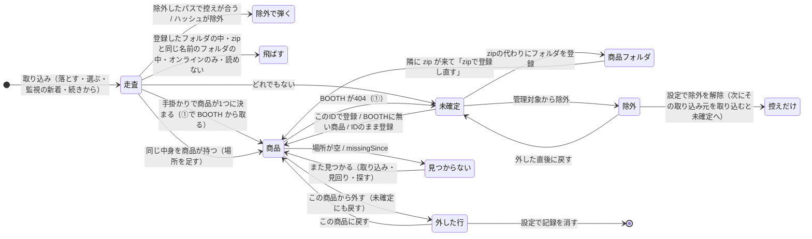

# 手元のファイルの一生（取り込み・見つからない・移動・例外）

> 2026-10-05 にコードを読んでまとめた地図。spec を手掛かりにし、食い違った所はコードの答えを書いた（食い違いは最後の「気になった所」）。
> 決め事そのものは `docs/spec/import.md`・`data-model.md`・`id-resolution.md`・`folder-view.md`・`background-and-network.md` が正。
> コードが変わったらこの文書は古くなる。関数名で Grep して確かめてから使う。

## 1画面の要約

1. **ファイルの行き先は4つ**：商品（`items/{id}.json` の `local.localFiles`）・未確定（`unresolved.json`）・除外（`excluded.json`）・どこにも載らない（走査の控え `scan-cache.json` にだけ在る）。フォルダごと登録した物は商品の `local.localFolders`。
2. **同一性はファイルならハッシュ、フォルダならパス。**同じ中身が2か所なら1件に `paths` が2つ。移す・名前を変えるとハッシュで同じ物と分かり、場所が差し替わる。フォルダは移すと「見つからない」。
3. **取り込み**は「走査 → ハッシュ（控えが合えば省く）→ 手掛かりで商品が1つに決まれば商品へ・同じ中身を持つ商品があればそこへ場所を足す・どちらでもなければ未確定」。行き先は毎回決め直す。
4. **「見つからない」は2通り**：場所が空（取り込みが無い場所を外した）と、場所はあるが `missingSince` が付いている（見回り・使おうとした画面が「無い」と見た）。印・検索の条件・統計は両方を数える（`ItemRecord.HasMissingFile`）。
5. **場所を外すのは取り込み（`LocalFileMerger`）と人の登録操作だけ**。見回りは日時を付け外しするだけで場所は外さない。**つながっていないドライブの上の物は外さず、日時も付けない**（例外は「気になった所」2）。
6. **人の判断は印で残す**：この商品から外した＝`detached`（行を残す。その商品へは自動で戻さない）／管理対象から除外＝`excluded.json`（中身に効く。場所ではない）／壊れたzip＝`archiveBroken`。
7. **起動時に自動で動くのはディスクの見回り（BOOTH へ行かない）と、設定で入れていれば裏の取得（⑤⑦は BOOTH へ行く）・監視の新着の取り込み**。一時展開は起動時と終了時に消す。
8. 書き込みは商品ごとの錠の中で今の値に当てる（`ChangeLocalAsync`）のが決まり。**守れていない所が4つある**（「気になった所」3）。

## 全体の流れ

## ファイルの状態と JSON の欄

| 状態（画面の言い方） | どこに | 欄・決め方 |
|---|---|---|
| 商品に結んだ | `items/{id}.json` `local.localFiles[]` | `hash`・`paths[]`・`sizeBytes`・`contents`・`variationId`・`unityPackages` |
| 未確定 | `unresolved.json` | `hash`・`paths`・`contents`・`zoneHostUrl`・`zoneReferrerUrl`・`candidateItemIds`・`samePathItemIds`・`archiveBroken` |
| 管理対象から除外 | `excluded.json` | `hash`・`paths`・`excludedAt`・`reason`。走査の控えと3点が合えばハッシュを取らずに弾く |
| この商品から外した（灰色の行） | 商品の `localFiles[]` | `detached: true`。所持・容量・検索・Unity へ送るに数えない（`LocalBlock.OwnedFiles`）。日時は持たない |
| 見つかりません（場所が空） | 商品の `localFiles[]` | `paths: []`。取り込みが無い場所を外した結果。記録は残す |
| 見つかりません（日時あり） | 商品の `localFiles[]`・`localFolders[]` | `missingSince`（最初に「無い」と見た日時。在ると見たら消す） |
| 取り外しているドライブ | 書かない | 根がつながっていない場所。記録は変えない。フォルダビュー・商品ページの札は、その場でディスクを見て出す |
| 壊れたzip | 未確定・商品の両方 | `archiveBroken: true`（zip の目録が読めなかった時だけ。開いていた・権限が無いは立てない） |
| フォルダごと登録 | 商品の `localFolders[]` | `path`（同一性）・`fileCount`・`totalBytes`・`registeredAt`・`lastSeenAt`・`missingSince`。中身は記録しない |
| 展開したフォルダ（zip の隣の同名フォルダ） | 書かない | 走査が `UnpackedFolderDetector`（名前だけで判定）で見つけ、中を取り込まない。取り込みの結果に「展開先」として出る |
| zip が無い展開物 | 未確定 | ふつうの未確定。`zoneReferrerUrl`（元 zip のパス）で束ねる。画面は記録の値だけを見る |
| 元zip が登録済みの中身 | 書かない | 未確定の画面が開くたびに決めて隠す（`ResolveViewModel.ZipUnit.cs` `HideCoveredContents`） |
| 一時展開 | `%TEMP%\Chmonos\unpacked-{保存先ごとの8桁}\` | 商品には書かない。起動時と終了時に消す |
| BOOTH の不調で取れなかった | `import-state.json` `unfetched` | 商品にも未確定にも無い。「続きから進む」で取り直す。監視はこのファイルを新着と数える |
| 控えだけ | `scan-cache.json` | パス・大きさ・更新日時・ハッシュ・`clueItemIds`。消してもよい。行き先は決めない |

**所持**＝外していないファイルかフォルダを1つ以上持つ（統計・ショップ・アバター）。ただし `ItemRecord.IsDownloaded` はフォルダを数えない（「気になった所」6）。

## 出来事ごとの表

### 取り込み（`Core/Scanning/ImportPipeline.cs` `RunCoreAsync`）

| 出来事 | 見る物 | 書く物 | 書かない物・残す物 | 場所 |
|---|---|---|---|---|
| 始め | 前回の `import-state.json` | `unfetched` だけ引き継いで書き直す | 前回の `targets`・`stopped` は消える | `RunCoreAsync` 冒頭 |
| 周回の頭 | 全商品 | 登録フォルダの数え直し（最初の周回だけ）・フォルダの `missingSince`／`lastSeenAt`（`ChangeLocalAsync`）・「zipが手に入った」通知 | フォルダの「無い」はドライブがつながっていない時は書かない | `LoadOwnedAsync` |
| 走査 | ディスク（木を1回たどる） | `volumes.json`・`import-state.json`（`scanning: true`） | 一時展開の中・ジャンクション・オンラインのみ・登録フォルダの中・展開したフォルダの中 | `ScanFolders`・`FolderScanner.Scan` |
| 取り込む拡張子 | 拡張子 | — | `.zip .rar .psd .ai .lip .pdf` 音声・`.epub .vroid .vrm .vrma .xwear` など・画像・動画。**単体の `.unitypackage`・`.7z` は取り込まない**（`FolderScanner.TargetExtensions`） | |
| ハッシュ | 控えの3点 | `scan-cache.json`（10秒ごとと周回の終わり） | 読めないファイルは数えてログへ。控えに書かない | `ResolveAsync` |
| 上書きされた場所 | 記録の場所 → 今のハッシュ | 古い中身の記録からその場所を外す。壊れた zip の記録だけ記録ごと落とす | 走査していない・読めない・つながっていない場所は触らない | `DropReplacedPathsAsync` |
| 除外 | `excluded.json` | — | 中身が違えば新しい物として通す | `ExclusionFilter` |
| 手掛かりで1つに決まる | zip の中の URL（控えの `clueItemIds`）・Zone.Identifier | その商品へ（既にあれば `LocalFileMerger` で足す、無ければ①で取って作る）。同じ中身を持つほかの商品にも場所を足す | `detached` の組は候補から落とす | `ResolveAsync`・`FetchAsync`・`RelinkMovedFilesAsync` |
| 同じ中身を商品が持つ | 全商品のハッシュ | 記録に無い場所を足す（移した・写した）。`archiveBroken` の答えが変わった時も書く | 外した行の商品には足さない | `RelinkMovedFilesAsync` |
| どれでもない | — | 未確定（`UnresolvedMerge.ForImport` で人の変更と合わせる）。上書きを見つけた回は `samePathItemIds` | 走査していない取り込み元・つながっていないドライブの未確定は残す | `SaveUnresolvedAsync` |
| ①で404 | BOOTH | 未確定へ（候補にその商品ID、`archiveBroken` を引き継ぐ） | `zoneReferrerUrl` は入らない（「気になった所」9） | `FetchAsync`・`ToUnresolved` |
| ①で不調 | BOOTH | `import-state.json` `unfetched` | 商品にも未確定にも入れない | `FetchAsync` |
| 見回り | 全商品のファイルの場所 | `missingSince` の付け外し（最初の周回だけ・結び直しの後） | 場所は外さない | `MissingMarksSweep.NoteFilesAsync` |
| 終わり | 取り込み元の下の控え | 消えたパスを控えから落とす。`import-state.json` を空に（不調があれば残す） | つながっていないドライブの控えは残す | `ScanCacheIndex.RemoveMissingUnder` |

`LocalFileMerger.Merge` の決まり：ハッシュで合わせて場所を足し合わせ、**今ディスクに無い場所は落とす**（つながっていないドライブの上は残す）。在る場所が1つでもあれば `missingSince` を消す。`variationId`・`contents`・`unityPackages` は前の値を残す。`detached` は両方が外していた時だけ残る（＝人が登録し直すと印は下りる）。

### 未確定の操作（`ResolveViewModel*.cs` → `ItemService`）

| 操作 | 命令 | 書く物 | 注意 |
|---|---|---|---|
| このIDで登録 | `AssignItemId`（1件ずつ） | 商品が無ければ BOOTH から取って作る。`ChangeLocalAsync` で `localFiles` に足す → 未確定から外す | 移るのは hash・paths・size・contents・archiveBroken だけ（`FromUnresolved`）。zone の欄・候補は捨てる |
| BOOTHに無い商品として登録 | `RegisterLocalItem` | 仮ID `local-…`（1件目のハッシュから）。未確定の錠を持ったまま作る | 問い合わせない |
| 見つからないIDのまま登録 | `AssignUnpublishedItemId` | 空の booth・`isDelisted`。⑦で確かめ直す | 問い合わせない |
| zipの代わりにフォルダを登録 | `RegisterFolder` | `localFolders` に足す（数えて）→ 配下の未確定を消す | 以後その配下は走査で飛ばす |
| 管理対象から除外 | `ExcludeFiles`（何件でも1回） | `excluded.json` に足す → 未確定から外す | 既に除外にあるハッシュは足さない |
| 外した直後に戻す | `UndoExclude` | 除外からハッシュで消し、画面の写しの未確定を戻す | |
| 開くたびの均し | `ReconcileUnresolved` | 商品が持つハッシュを未確定から外す | 登録の2段（商品→未確定）の間に落ちた時の後始末 |

### 商品ページ・設定の操作

| 操作 | 命令 | 書く物 | 注意 |
|---|---|---|---|
| この商品から外す | `DetachFile` | 今在る場所だけ未確定へ（Zone.Identifier を読み直す・`archiveBroken` 引き継ぎ）→ `detached: true` | 最後のファイルなら「非表示にして残す／残す／完全に削除」を聞く。無いファイルは未確定に戻らない |
| この商品に戻す | `ReattachFile` | `detached` を下ろす → 未確定から外す | ほかの商品が持っていれば断る |
| 外した記録を消す（設定） | `ForgetDetached` | 外した行を消す | 次の取り込みで手掛かりから同じ商品へ戻り得る |
| 除外を解除（設定） | `RestoreExcluded` | `excluded.json` から消す | 未確定には戻さない。その取り込み元を取り込み直すまで、どこにも出ない（監視の新着にも数えない） |
| フォルダの登録を外す | `UnregisterFolder` | `localFolders` から消す | ファイルには触らない。中身は次の取り込みで未確定へ |
| zipで登録し直す（通知） | `SwapFolderForArchive` | 隣の zip を1本ハッシュして `localFiles` へ・フォルダの登録を外す・未確定から消す | ディスクには触らない |
| IDを変える | `ChangeItemId` | 移す先へ `LocalFileMerger` で合わせる（移す元の `variationId` は捨てる）・フォルダは足す | 外した印は両方外していた時だけ残る |
| 非表示 | `SaveItemLocal`（`IsHidden`） | `isHidden` だけ | ファイルには触らない。統計には数える |
| 完全に削除 | `DetachFile(DeleteItemWhenEmpty)` | `DeleteIfAsync`（空の時だけ） | 改変・最近などの参照は付け替えない |
| 種類を付ける | `SetFileVariations` | `variationId` | 編集画面の「ファイルを追加…」もこれ。ファイルを商品へ直に足す操作は無い |
| 展開先フォルダの削除（取り込み画面） | `RemoveUnpackedFolders` | ディスクのフォルダをごみ箱へ | 記録には書かない。登録したフォルダかは見ない（「気になった所」4） |

**ドロップ**（`Core/Services/DropRouting.cs`・`MainViewModel.Drop.cs`）：ファイルはどの画面でも取り込みに積む（商品ページに落としてもその商品には結ばない。画像だけなら画像として足す）。商品の URL は開くか「ファイルを持たない商品として登録」。未確定で行を選んでいれば、URL はその行の商品IDの欄へ。落としたときは取り込み画面へ移らず、下の帯で進み具合を出す。

### 見つからない

| いつ | 何を見る | 書く物 | 場所 |
|---|---|---|---|
| 取り込み（最初の周回） | 全商品のファイルの場所（ドライブごとに根を1回・3秒で打ち切り） | `missingSince` の付け外し | `MissingMarksSweep.NoteFilesAsync`・`FilePresenceProbe` |
| 取り込み（周回の頭） | 登録フォルダ（`Directory.Exists`・打ち切り無し） | フォルダの `missingSince`／数え直し | `LoadOwnedAsync` |
| 取り込みが商品を扱った時 | その商品の場所 | 無い場所を外す（場所が空になり得る） | `LocalFileMerger.Merge` |
| 起動時（窓を出した後） | ファイルとフォルダ全部 | `missingSince`。設定に関わらず走る | `MainViewModel.Background.cs` `StartMissingMarksSweep` → `MissingMarksSweep.SweepAsync` |
| 使おうとした時 | 商品ページを開く・エクスプローラで開く・展開・Unityへ送れなかった（商品ページと検索のカードの1件） | `NoteFilePresence` → `ItemService.NoteFilePresenceAsync`（`LocalOwners.FilePresence`） | `FilePresenceNotes.cs`・`ItemViewModel.Files.cs`・`ItemFileActions.cs`・`ItemUnityActions.cs` |
| 「見つからないファイルを探す」（取り込み画面） | **監視フォルダの中だけ**。大きさが合う物だけハッシュ（控えを使う）。探すのはどの場所にも無い物だけ（`FilePresenceProbe`。場所の1つでもつながっていないドライブの上なら探さず、場所も外さない） | 見つけたら無い場所を差し替え・日時を消す。見つからなければ日時を付ける。`scan-cache.json` に足す | `MissingFileFinder.FindAsync`・`Replace`・`NoteNotFoundAsync` |
| フォルダビュー | その場でディスク（ドライブ文字の読み替えの後） | 書かない | `FolderViewModel.Build` |

付け外しの決まりは1つ（`FileMissingMarks.Apply`）：在る→消す／無い→無ければ今の時刻（あれば最初の日時のまま）／つながっていないドライブだけ→何もしない／見てから書くまでに場所が変わったファイルには当てない。場所が複数なら1つ在れば「在る」。

### 移動

| したこと | 起きること |
|---|---|
| 取り込み元の中でファイルを移す・名前を変える | 取り込むとハッシュで同じ物と分かり、新しい場所が足され、古い場所は `LocalFileMerger` が落とす |
| 取り込み元の外へ移す | その場所を取り込むまで古い場所のまま「見つかりません」。監視フォルダへ移したなら「見つからないファイルを探す」で結び直せる |
| 同じ名前で別の中身に上書き | 古い中身の記録から場所が外れ（場所が空でも記録は残る）、新しい中身は手掛かりで決まらなければ未確定へ（`samePathItemIds` に前の商品） |
| ドライブ文字が変わる | 記録は書き換えない。フォルダビューと検索の `path:` だけ `volumes.json` で読み替える。ほかの画面は元のパスで見る（「気になった所」2）。次にその場所を取り込むと今の文字の場所が足される |
| 外付けを外す | 場所は外さない・日時も付けない・未確定も残す。札は「取り外しているドライブ」 |
| フォルダごと登録した物を移す | パスが同一性なので「見つからない」。取り込みは新しい場所の中身を未確定に出す |

### 一時展開（`Core/Services/TemporaryUnpacker.cs`）

`UnpackToTemporary` が `%TEMP%\Chmonos\unpacked-{保存先ごと}\{名前}-{印}` に展開し、終わったら `.done` を置く。商品には書かない（開く前の在る・無しの `missingSince` だけ）。壊れていて失敗しても `archiveBroken` は付けない。片付けは起動時（`AppServiceContainer`・窓を出す前に同期で。1つ目のアプリだけ）と終了時（`App.OnExit`）。走査は取り込み元がこの中なら何も返さない。

### 保存先の引越し・バックアップ

`StoreMover`（`MoveStore`）は保存先を丸ごと写して突き合わせてから元を消す。`BackupArchive` は zip に書き出し、空の所へ戻すだけ。**どちらも手元のファイルの記録（パス）を書き換えず、アセットのファイルも動かさない。** `scan-cache.json`・`volumes.json`・`import-state.json` も一緒に運ぶ（バックアップは `.tmp`・`location.json` などを入れない）。

## 例外的な動き・落とし穴

- **外付けのドライブ**：「つながっていない」は根（`D:\`・`\\server\share`）が見えないこと。見回り・使う時・「見つからないファイルを探す」は根を3秒で打ち切る（`FilePresenceProbe`）。取り込みの `LocalFileMerger`・`UnresolvedMerge`・控えの片付け・登録フォルダの判定は `UnresolvedMerge.IsOnMissingVolume`（`Directory.Exists(root)`・打ち切り無し）。
- **届かない共有**：根の確かめは1回21秒かかったことがある。打ち切りがあるのは見回りの道だけ。
- **同じ中身が複数の場所**：商品は1件に複数の `paths`。容量は商品ページが1回、統計の実占有は場所の数だけ。未確定は1件に**最初の場所だけ**残る（「気になった所」8）。同じ中身を2つの商品が持つことはあり得て、取り込みは両方に場所を足す。
- **ハッシュの扱い**：ファイルは SHA-256。控え（パス・大きさ・更新日時）が合えば取り直さない。持っている zip は開き直さない（中身の一覧は商品、手掛かりは控え）。**フォルダはハッシュを持たない**（中の1ファイルで別物になるため）。
- **展開したフォルダの見分けは名前だけ**：zip と同じ名前のフォルダは、中身が別物でも取り込まない。zip を消すと次の取り込みで中身が出てくる。
- **錠と同時の書き込み**：商品は `ChangeLocalAsync`・`CreateOrChangeLocalAsync`（錠の中で今の値に当てる）。`unresolved.json`・`excluded.json`・`scan-cache.json` は `JsonFileStore.UpdateAsync`。取り込み中に人が未確定を片付けても `UnresolvedMerge` が残す。見回りと取り込みのフォルダの判定は同じ番（`MissingMarksSweep.EnterAsync`）で1本ずつ。
- **ドロップ**：ファイルは必ず取り込みに積む（結ぶ相手を選ぶ道は無い）。展開先の中のファイルを落とすと、元の zip に替えるか聞く（`UnpackedFileResolver`。自動で始めた時は聞かずに通知）。
- **監視フォルダ**：新着＝除外・登録フォルダの下でなく、控えに3点が合う行が無い物か、`unfetched` に載っている物（`FolderWatch.FindNewAsync`。ハッシュを取らない）。控えに載っていれば、商品にも未確定にも無くても新着と数えない。
- **起動時の自動の動き**：

| 動き | BOOTH | 設定で切れるか |
|---|---|---|
| 一時展開の片付け（窓の前） | 行かない | 切れない |
| 古い `.tmp` の掃除・見回り（`missingSince`）・最近の足跡の掃除・動画の題の整理 | 行かない | 切れない |
| 通知の整理・ページの作りの確認・手で直した JSON の確認 | 行かない | `ResumeFetchInBackground` を切ると**一緒に止まる**（「気になった所」5） |
| ③検出し直し（知らないアバターだけ問い合わせる）・⑤残りの画像・持っていないアバターの画像・⑦期限の来た商品 | 行く | `ResumeFetchInBackground`（設定「起動したとき、裏で取得を始める」） |
| 監視の新着と前回の続きの取り込み | 行く（①②） | `StartImportOnLaunch`。切なら件数の帯だけ |

## 用語（画面 ↔ コード）

| 画面 | コード・JSON |
|---|---|
| 手元のファイル | `LocalFileRecord`・`local.localFiles` |
| フォルダごと登録した商品・zipの代わりにフォルダを登録 | `LocalFolderRecord`・`local.localFolders`・`RegisterFolder` |
| 未確定 | `UnresolvedFile`・`unresolved.json` |
| 管理対象から除外／除外を解除 | `ExcludeFiles`／`RestoreExcluded`・`UndoExclude`・`excluded.json` |
| この商品から外す／この商品に戻す | `DetachFile`／`ReattachFile`・`detached` |
| 見つかりません | 場所が空（`paths: []`）か `missingSince`・`HasMissingFile` |
| 取り外しているドライブ | `FilePresence.OnDetachedDrive`・`IsOnMissingVolume` |
| 壊れたzip | `archiveBroken`・`HasBrokenArchive` |
| 同じ場所にあった | `samePathItemIds` |
| 展開元（元zip） | `zoneReferrerUrl`・`UnresolvedOrigin` |
| 展開先・展開したフォルダ | `UnpackedFolder`・`UnpackedFolderDetector` |
| 一時的に展開して開く | `UnpackToTemporary`・`TemporaryUnpacker` |
| 取り込み元の履歴・監視 | `AppSettings.ImportFolders`・`WatchedFolders`・`FolderWatch` |
| 続きから進む／続きを捨てる | `import-state.json`（`targets`・`unfetched`・`scanning`・`stopped`）・`DiscardInterruptedImport` |
| 見つからないファイルを探す | `FindMissingFiles`・`MissingFileFinder` |
| 中身を確かめた／確かめを省いた | ハッシュを取った／控えから使った |
| BOOTHに無い商品（仮のID） | `local-…`・`LocalItemId` |

## 気になった所（直していない。重い順）

1. **「見つからないファイルを探す」が、外付けの上の場所を外し得る**：`MissingFileFinder.FindCoreAsync` は無い場所を `DiskCheck.FileExists` だけで決め、ドライブがつながっているかを見ない。外付けを外したまま同じ中身が監視フォルダにあると、`Replace` が外付けの上の場所を外す（`LocalFileMerger` の「残す」と食い違う）。外付けを外しただけの物を「見つかりませんでした」とも数える。打ち切りも無いので落ちた共有で待たされ得る。
2. **ドライブ文字が変わると画面ごとに答えが違う**：読み替えはフォルダビューと検索だけ。元の文字が空なら商品ページは「取り外しているドライブ」で開けない。元の文字に別のディスクが来ると、見回りが日時を付け、取り込みがその商品を扱うと `LocalFileMerger` が場所を外し得る（後半は推測）。
3. **錠の外で読んだ写しで書き戻す所が4つ**（CLAUDE.md の「錠の中で今の値に当てる」に反する）：
   - `ItemService.SwapFolderForArchiveAsync`：読んでから zip をハッシュ（数秒〜）した後に `SaveLocalAsync(…, LocalOwners.Import)`。その間の取り込みの追加・種類・外す／戻す・`missingSince` が `localFiles`／`localFolders` ごと古い値に戻り得る。
   - `ItemService.UnregisterFolderAsync`：同じ形（`Import` は `localFiles` も持つ）。間は短い。
   - `SettingsService.ForgetDetachedAsync`：`localFiles` を写しで書く。
   - `SettingsService.UnhideAsync`：`isHidden` だけで害は小さい。
   - ほかに取り込みの `FetchAsync`（既にある商品へ足す道）も、読んだ直後に写しで `SaveLocalAsync` している（間はごく短い）。
4. **取り込み画面の「展開先フォルダの削除」が、商品として登録したフォルダもごみ箱へ送り得る**：`UnpackedFolderRemover.FindRefusal` は zip が在る・同じ親・名前が合うしか見ず、`localFolders` を見ない。zip の隣のフォルダを登録した商品（`SwapFolderForArchive` が直そうとする状態）で起きる。ごみ箱なので戻せるが、その間は「見つからない」。
5. **「裏で取得を始める」を切ると、通信しない確かめまで止まる**：`MainViewModel.StartBacklog` の頭で丸ごと戻るので、通知の整理・ページの作りの確認・手で直した JSON の確認も走らない。コメント（「通信はしないので、裏の取得を切っていても見る」）と spec（通知の上限を起動時にも当てる）に反する。
6. **`ItemRecord.IsDownloaded` がフォルダを数えない**：所持の定義は「ファイルかフォルダ」だが、`IsDownloaded` は外していないファイルだけ。フォルダだけの商品が、検索のカードで「未取得」・所持でない扱い（`SearchViewModel.Filtering.cs` の `IsOwned`・`SizeText`）、改変の画面で「無い」扱い（`ModificationViewModel`・`ModificationHubRows`）になり得る。統計・ショップ・アバターは別の式でフォルダも数えていて、画面によって所持の答えが違う。
7. **`SwapFolderForArchiveAsync` は外した印・ほかの持ち主・除外を見ない**：その zip を前に外していると「登録済み」と見てフォルダの登録だけ外し、商品の所持が無くなる。ほかの商品が持つ zip でも足す。
8. **未確定は同じ中身の2か所目を落とす**：取り込みは1ファイル1件で未確定を作り、`UnresolvedMerge.ForImport` がハッシュで最初の1件だけを残す。2か所目はフォルダビューの「?」にも出ない（登録すれば次の取り込みで商品に足されるので失われはしない。試験は見当たらない）。
9. **①で404になって未確定へ戻した物は `zoneReferrerUrl`・`zoneHostUrl` を持たない**（`ImportPipeline.ToUnresolved`）。毎回同じ道を通るので取り込み直しても付かず、元zip の束に入らない。spec の「取り込み直すと書き直される」と合わない。
10. **除外を解除した物がどこにも出ない期間がある**：`RestoreExcluded` は未確定に戻さず、控えに載っているので監視の新着にも数えない。その取り込み元を履歴から取り込み直すまで見えない（spec「次の取り込みでまた未確定に出る」は、対象に積んだ時だけ正しい）。外した記録を消す（`ForgetDetached`）も同じく、次の取り込みで手掛かりから同じ商品へ戻り得る。
11. **「BOOTHに無い商品」の名前が上書きされ得る**：仮ID はハッシュから決まるので、外した後に同じファイルをもう一度「BOOTHに無い商品として登録」すると、既にある商品の `displayName` を欄の下書き（ファイル名）で上書きする（`RegisterLocalItemAsync` の既にある枝）。
12. **「IDを変える」で外した印が下り得る**：移す先で外していたファイルを移す元が持っていると、`LocalFileMerger` の決まりで持ち物に戻る。
13. **人の登録操作でもほかのファイルの場所が落ちる**：このIDで登録・IDを変える・zipで登録し直すも `LocalFileMerger.Merge`（既定の `File.Exists`）を通るので、同じ商品のほかのファイルの無い場所をその場で外す。`missingSince` の「場所は外さない」の趣旨と合わない（取り込みと同じ動きではある）。
14. **「IDのまま登録」だけ一覧のチェックを見ない**：`ResolveViewModel.Unpublished.cs` `AssignUnpublishedAsync` は `ActiveRows` だけ使う。spec の「今の対象」（チェックがあればその全部）と食い違う（画面では確かめていない）。
15. **取り込みの登録フォルダの判定に打ち切りが無い**：`LoadOwnedAsync` は `Directory.Exists` と `IsOnMissingVolume`。spec（background-and-network.md）は見回りと同じ部品・3秒の打ち切りと書いている。落ちた共有の上の登録フォルダで周回の頭が長く止まり得る（推測）。
16. **探して見つからなかった日時が、検索にすぐ出ない**：`ImportViewModel.FindMissingFilesAsync` は結び直した数が1以上の時だけ検索の写しを読み直す。
17. **Unity へ送る道の一部が「無い」を記録しない**：検索の複数選択（`ItemSelectionActions`）・改変の画面（`ModificationViewModel`・`UnityMemberSelect`）は `FilePresenceNotes` を通らない。spec は区別していない。
18. **除外を「戻す」と前からの除外まで消える**：`ExcludeAsync` は既にあるハッシュを足さないが、`UndoExcludeAsync` はハッシュで全部消す。前に除外していた物の記録（日時・理由）も消える。
19. 小さな物：見回りは在るフォルダの `lastSeenAt` を更新しない（取り込みの数え直しだけ）。展開したフォルダの見分けが名前だけ。取り込み元に `%TEMP%` そのものを選ぶと一時展開の中まで走査する（根だけを見ているため）。`ImportPipeline.NextFetchDue` の `GetHashCode` はプロセスごとに変わるので、コメントの「何度計算しても同じ日」にならない。spec の item-page.md にある「管理から外す」（一括操作）は App に見当たらない。spec の「IDを変更」は画面では「IDを変える」。
