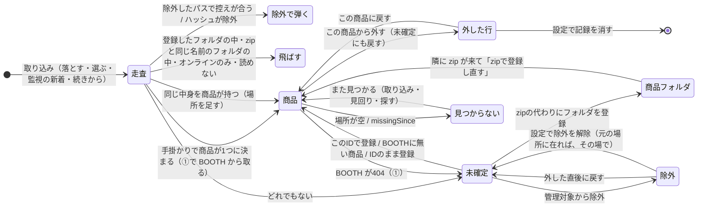

# 手元のファイルの一生（取り込み・見つからない・移動・例外）

> 2026-10-05 にコードを読んでまとめた地図。spec を手掛かりにし、食い違った所はコードの答えを書いた（食い違いは最後の「気になった所」）。
> 決め事そのものは `docs/spec/import.md`・`data-model.md`・`id-resolution.md`・`folder-view.md`・`background-and-network.md` が正。
> コードが変わったらこの文書は古くなる。関数名で Grep して確かめてから使う。

## 1画面の要約

1. **ファイルの行き先は4つ**：商品（`items/{id}.json` の `local.localFiles`）・未確定（`unresolved.json`）・除外（`excluded.json`）・どこにも載らない（走査の控え `scan-cache.json` にだけ在る）。フォルダごと登録した物は商品の `local.localFolders`。
2. **同一性はファイルならハッシュ、フォルダならパス。**同じ中身が2か所なら1件に `paths` が2つ。移す・名前を変えるとハッシュで同じ物と分かり、場所が差し替わる。フォルダは移すと「見つからない」。
3. **取り込み**は「走査 → ハッシュ（控えが合えば省く）→ 手掛かりで商品が1つに決まれば商品へ・同じ中身を持つ商品があればそこへ場所を足す・どちらでもなければ未確定」。行き先は毎回決め直す。
4. **「見つからない」は2通り**：場所が空（取り込みが無い場所を外した）と、場所はあるが `missingSince` が付いている（見回り・使おうとした画面が「無い」と見た）。印・検索の条件・統計は両方を数える（`ItemRecord.HasMissingFile`）。**同じ場所で新しい中身に置き換わった古い版（`replaced`）は数えない**（点検の8）。
5. **場所を外すのは取り込み（`LocalFileMerger.Merge`）と、見回りが同じ中身のほかの場所に在ると確かめたときだけ**。人の登録操作（`MergeByHand`）は外さない。**つながっていないドライブ（控えた文字に別のディスクが来ている場合を含む）・権限が無く確かめられない場所の上の物は外さず、日時も付けない**（点検の2・13）。
6. **人の判断は印で残す**：この商品から外した＝`detached`（行を残す。その商品へは自動で戻さない）／管理対象から除外＝`excluded.json`（中身に効く。場所ではない）／壊れたzip＝`archiveBroken`。
7. **起動時に自動で動くのはディスクの見回り（BOOTH へ行かない）と、設定で入れていれば裏の取得（⑤⑦は BOOTH へ行く）・監視の新着の取り込み**。一時展開は起動時と終了時に消す。
8. 書き込みは商品ごとの錠の中で今の値に当てる（`ChangeLocalAsync`）のが決まり（守れていなかった4つと取り込みの1つは 2026-10-05 に直した。「気になった所」3）。

## 全体の流れ

## ファイルの状態と JSON の欄

| 状態（画面の言い方） | どこに | 欄・決め方 |
|---|---|---|
| 商品に結んだ | `items/{id}.json` `local.localFiles[]` | `hash`・`paths[]`・`sizeBytes`・`contents`・`variationId`・`unityPackages` |
| 未確定 | `unresolved.json` | `hash`・`paths`・`contents`・`zoneHostUrl`・`zoneReferrerUrl`・`candidateItemIds`・`samePathItemIds`・`archiveBroken` |
| 管理対象から除外 | `excluded.json` | `hash`・`paths`・`excludedAt`・`reason`。走査の控えと3点が合えばハッシュを取らずに弾く |
| この商品から外した（灰色の行） | 商品の `localFiles[]` | `detached: true`。所持・容量・検索・Unity へ送るに数えない（`LocalBlock.OwnedFiles`）。日時は持たない |
| 見つかりません（場所が空） | 商品の `localFiles[]` | `paths: []`。取り込みが無い場所を外した結果。記録は残す |
| 古い版（同じ場所で新しい中身に置き換わった） | 商品の `localFiles[]` | `paths: []` と `replaced: { path, at }`（置き換わった場所と日時）。「見つかりません」に数えない（`LocalFileRecord.IsOldVersion`）。また取り込んで場所が付けば印を消す |
| 見つかりません（日時あり） | 商品の `localFiles[]`・`localFolders[]` | `missingSince`（最初に「無い」と見た日時。在ると見たら消す） |
| 取り外しているドライブ | 書かない | 根がつながっていない場所と、控えた文字（`volumes.json`）に控えたのと別のディスクが来ている場所（ドライブ文字が変わった分は読み替えた後の場所で見る）。記録は変えない。フォルダビュー・商品ページの札は、その場でディスクを見て出す |
| 壊れたzip | 未確定・商品の両方 | `archiveBroken: true`（zip の目録が読めなかった時だけ。開いていた・権限が無いは立てない） |
| フォルダごと登録 | 商品の `localFolders[]` | `path`（同一性）・`fileCount`・`totalBytes`・`registeredAt`・`lastSeenAt`・`missingSince`。中身は記録しない |
| 展開したフォルダ（zip の隣の同名フォルダ） | 書かない | 走査が `UnpackedFolderDetector`（名前だけで判定）で見つけ、中を取り込まない。取り込みの結果に「展開先」として出る |
| zip が無い展開物 | 未確定 | ふつうの未確定。`zoneReferrerUrl`（元 zip のパス）で束ねる。画面は記録の値だけを見る |
| 元zip が登録済みの中身 | 書かない | 未確定の画面が開くたびに決めて隠す（`ResolveViewModel.ZipUnit.cs` `HideCoveredContents`） |
| 一時展開 | `%TEMP%\Chmonos\unpacked-{保存先ごとの8桁}\` | 商品には書かない。起動時と終了時に消す |
| BOOTH の不調で取れなかった | `import-state.json` `unfetched` | 商品にも未確定にも無い。「続きから進む」で取り直す。監視はこのファイルを新着と数える |
| 控えだけ | `scan-cache.json` | パス・大きさ・更新日時・ハッシュ・`clueItemIds`。消してもよい。行き先は決めない |

**所持**＝外していないファイルかフォルダを1つ以上持つ。答えは `LocalBlock.IsOwned`（`ItemRecord.IsOwned`）1か所で、検索・改変・統計・ショップ・アバターが同じ物を使う。ファイルが要る場面（Unity へ送る・中身を読む）は `HasOwnedFiles`、容量は `OwnedSizeBytes`（ファイル＋フォルダ）（「気になった所」6）。

## 出来事ごとの表

### 取り込み（`Core/Scanning/ImportPipeline.cs` `RunCoreAsync`）

| 出来事 | 見る物 | 書く物 | 書かない物・残す物 | 場所 |
|---|---|---|---|---|
| 始め | 前回の `import-state.json` | `unfetched` だけ引き継いで書き直す | 前回の `targets`・`stopped` は消える | `RunCoreAsync` 冒頭 |
| 周回の頭 | 全商品 | 登録フォルダの数え直し（最初の周回だけ）・フォルダの `missingSince`／`lastSeenAt`（`ChangeLocalAsync`）・「zipが手に入った」通知 | フォルダの「無い」はドライブがつながっていない・根が3秒で答えない時は書かない（`FilePresenceProbe`） | `LoadOwnedAsync` |
| 走査 | ディスク（木を1回たどる） | `volumes.json`・`import-state.json`（`scanning: true`） | 一時展開の置き場（取り込み元がその外側でも降りない）・ジャンクション・シンボリックリンク（たどらないが、数を結果に・場所をログに出す）・オンラインのみ・登録フォルダの中・展開したフォルダの中 | `ScanFolders`・`FolderScanner.Scan` |
| 取り込む拡張子 | 拡張子 | — | `.zip .rar .psd .ai .lip .pdf` 音声・`.epub .vroid .vrm .vrma .xwear` など・画像・動画。**単体の `.unitypackage`・`.7z` は取り込まない**（`FolderScanner.TargetExtensions`） | |
| ハッシュ | 控えの3点 | `scan-cache.json`（10秒ごとと周回の終わり） | 読めないファイルは数えてログへ。控えに書かない | `ResolveAsync` |
| 上書きされた場所 | 記録の場所 → 今のハッシュ | 古い中身の記録からその場所を外す。場所が残らなければ古い版の印 `replaced` を付け、`missingSince` を消す。壊れた zip の記録だけ記録ごと落とす | 走査していない・読めない・つながっていない場所は触らない | `DropReplacedPathsAsync` |
| 除外 | `excluded.json` | — | 中身が違えば新しい物として通す | `ExclusionFilter` |
| 手掛かりで1つに決まる | zip の中の URL（控えの `clueItemIds`）・Zone.Identifier | その商品へ（既にあれば `LocalFileMerger` で足す、無ければ①で取って作る）。同じ中身を持つほかの商品にも場所を足す | `detached` の組は候補から落とす。書く時も錠の中の今の値で外してあるハッシュは足さない（`NotDetachedIn`） | `ResolveAsync`・`FetchAsync`・`RelinkMovedFilesAsync` |
| 同じ中身を商品が持つ | 全商品のハッシュ | 記録に無い場所を足す（移した・写した）。`archiveBroken` の答えが変わった時も書く | 外した行の商品には足さない | `RelinkMovedFilesAsync` |
| どれでもない | — | 未確定（`UnresolvedMerge.ForImport` で人の変更と合わせる。同じ中身が2か所なら1件に場所を2つ）。上書きを見つけた回は `samePathItemIds` | 今回見ていない場所の未確定は残す：走査していない取り込み元・つながっていないドライブ・中を読めなかったフォルダの下・オンラインのみ・ハッシュを取れなかった物 | `SaveUnresolvedAsync` |
| ①で404 | BOOTH | 未確定へ（候補にその商品ID、`archiveBroken` を引き継ぐ。Zone.Identifier を読み直して `zoneHostUrl`・`zoneReferrerUrl`） | | `FetchAsync`・`ToUnresolved` |
| ①で不調 | BOOTH | `import-state.json` `unfetched` | 商品にも未確定にも入れない | `FetchAsync` |
| 見回り | 全商品のファイルの場所 | `missingSince` の付け外し（最初の周回だけ・結び直しの後。見方は周回の頭と共用）。同じ中身のほかの場所に在ると確かめたら、無いと確かめた場所を外す | それ以外は場所を外さない | `MissingMarksSweep.NoteFilesAsync`・`FilePresenceProbe.Sight` |
| 終わり | 取り込み元の下の控え・今回見た中身の控え | 消えたパスを控えから落とす。今回見た中身と同じ中身の、もう無い場所（移した元）も落とす。`import-state.json` を空に（不調があれば残す） | つながっていないドライブの控えは残す | `ScanCacheIndex.RemoveMissingUnder`・`RemoveMovedAway` |

`LocalFileMerger.Merge` の決まり：ハッシュで合わせて場所を足し合わせ、**今ディスクに無い場所は落とす**（つながっていない・控えた文字に別のディスクが来ている・権限が無く確かめられない場所は残す。在るかは周回の頭の `FilePresenceProbe` を根の覚えだけ新しくして見る。人の登録操作の `MergeByHand` は無い場所も残す）。同じ場所の綴りは見つけた方に合わせる（大文字小文字だけの改名）。在る場所が1つでもあれば `missingSince` を消す。`variationId`・`contents`・`unityPackages` は前の値を残す。`detached` は両方が外していた時だけ残る（＝人が登録し直すと印は下りる）。場所が残った物の古い版の印 `replaced` は消す。

### 未確定の操作（`ResolveViewModel*.cs` → `ItemService`）

| 操作 | 命令 | 書く物 | 注意 |
|---|---|---|---|
| このIDで登録 | `AssignItemId`（1件ずつ） | 商品が無ければ BOOTH から取って作る。`ChangeLocalAsync` で `localFiles` に足す → 未確定から外す | 移るのは hash・paths・size・contents・archiveBroken だけ（`FromUnresolved`）。zone の欄・候補は捨てる |
| BOOTHに無い商品として登録 | `RegisterLocalItem` | 仮ID `local-…`（1件目のハッシュから）。未確定の錠を持ったまま作る。既にあればファイルを足すだけで名前は残す（空の時だけ入れる） | 問い合わせない |
| 見つからないIDのまま登録 | `AssignUnpublishedItemId` | 空の booth・`isDelisted`。⑦で確かめ直す | 問い合わせない。対象はほかの登録と同じ今の対象（チェックがあればその全部） |
| zipの代わりにフォルダを登録 | `RegisterFolder` | `localFolders` に足す（数えて）→ 配下の未確定を消す | 以後その配下は走査で飛ばす |
| 管理対象から除外 | `ExcludeFiles`（何件でも1回） | `excluded.json` に足す → 未確定から外す | 既に除外にあるハッシュは足さない |
| 外した直後に戻す | `UndoExclude` | 除外からは今回足したハッシュだけ消し（`ExcludeFiles` の結果 `FilesExcluded` が返す）、画面の写しの未確定を戻す | 前から除外していた物の記録（日時・理由）は残る |
| 開くたびの均し | `ReconcileUnresolved` | 商品が持つハッシュを未確定から外す | 登録の2段（商品→未確定）の間に落ちた時の後始末 |

### 商品ページ・設定の操作

| 操作 | 命令 | 書く物 | 注意 |
|---|---|---|---|
| この商品から外す | `DetachFile` | 今在る場所だけ未確定へ（Zone.Identifier を読み直す・`archiveBroken` 引き継ぎ）→ `detached: true` | 最後のファイルなら「非表示にして残す／残す／完全に削除」を聞く。無いファイルは未確定に戻らない |
| 古い版の記録を片付ける | `ForgetOldVersion` | 古い版の行を消す（錠の中で、まだ古い版のときだけ） | ディスクには触らない。窓で聞かない。外した行には出さない（設定の「外した記録を消す」で片付く） |
| この商品に戻す | `ReattachFile` | `detached` を下ろす → 未確定から外す | ほかの商品が持っていれば断る |
| 外した記録を消す（設定） | `ForgetDetached` | 外した行を消す | 次の取り込みで手掛かりから同じ商品へ戻り得る |
| 除外を解除（設定） | `RestoreExcluded` | `excluded.json` から消す → 元の場所に同じ中身が在れば、その場で未確定へ（そのファイルから大きさ・日時・Zone.Identifier・zip の中身を読み、候補は控えの手掛かり） | 無い・中身が変わった・商品が持つなら未確定には足さず、設定の行の下にそう言う |
| フォルダの登録を外す | `UnregisterFolder` | `localFolders` から消す | ファイルには触らない。中身は次の取り込みで未確定へ |
| zipで登録し直す（通知） | `SwapFolderForArchive` | 隣の zip を1本ハッシュして（錠の外）、錠の中で今の `localFiles` へ足し（`MergeByHand`）・フォルダの登録を外す → 未確定から消す | ディスクには触らない。ハッシュの間に商品が消されたら何も書かない。外していた zip は印を下ろして付ける。除外した zip・ほかの商品が持つ zip は何も書かずに返し、画面が窓で聞く（除外を解く／その商品を開く・この商品に付け直す＝向こうに外した印） |
| IDを変える | `ChangeItemId` | 移す先へ `LocalFileMerger.MergeByHand` で合わせる（移す元の `variationId` は捨てる。無い場所も残す）・フォルダは足す | 外した印は、移す先が持つファイルは移す先の答えのまま。移す元だけが持つ物は印ごと運ぶ |
| 非表示 | `SaveItemLocal`（`IsHidden`） | `isHidden` だけ | ファイルには触らない。統計には数える |
| 完全に削除 | `DetachFile(DeleteItemWhenEmpty)` | `DeleteIfAsync`（空の時だけ） | 改変・最近などの参照は付け替えない |
| 種類を付ける | `SetFileVariations` | `variationId` | 編集画面の「ファイルを追加…」もこれ。ファイルを商品へ直に足す操作は無い |
| 展開先フォルダの削除（取り込み画面） | `RemoveUnpackedFolders` | ディスクのフォルダをごみ箱へ | 記録には書かない。消す直前に、zip が在る・名前が合う・商品に登録したフォルダに重ならない（そのもの・中・外）を確かめ直し、重なれば消さずに理由を出す |

**ドロップ**（`Core/Services/DropRouting.cs`・`MainViewModel.Drop.cs`）：ファイルはどの画面でも取り込みに積む（商品ページに落としてもその商品には結ばない。画像だけなら画像として足す）。商品の URL は開くか「ファイルを持たない商品として登録」。未確定で行を選んでいれば、URL はその行の商品IDの欄へ。落としたときは取り込み画面へ移らず、下の帯で進み具合を出す。

### 見つからない

| いつ | 何を見る | 書く物 | 場所 |
|---|---|---|---|
| 取り込み（最初の周回） | 全商品のファイルの場所（ドライブごとに根を1回・3秒で打ち切り） | `missingSince` の付け外し | `MissingMarksSweep.NoteFilesAsync`・`FilePresenceProbe` |
| 取り込み（周回の頭） | 登録フォルダ（`FilePresenceProbe`。ドライブごとに根を1回・3秒で打ち切り） | フォルダの `missingSince`／数え直し | `LoadOwnedAsync` |
| 取り込みが商品を扱った時 | その商品の場所（`FilePresenceProbe`） | 無い場所を外す（場所が空になり得る）。人の登録操作は外さない | `LocalFileMerger.Merge`（人は `MergeByHand`） |
| 起動時（窓を出した後） | ファイルとフォルダ全部 | `missingSince`（在るフォルダの `lastSeenAt` は空のとき・また見つかったときだけ）。設定に関わらず走る | `MainViewModel.Background.cs` `StartMissingMarksSweep` → `MissingMarksSweep.SweepAsync` |
| 使おうとした時 | 商品ページを開く・エクスプローラで開く・展開・Unityへ送れなかった（商品ページ・検索の複数選択・フォルダビュー・改変の画面・「Unityで選択」。人が止めた分は見ない）。場所は読み替えた後で見る | `NoteFilePresence` → `ItemService.NoteFilePresenceAsync`（`LocalOwners.FilePresence`） | `FilePresenceNotes.cs`（`Look`・`NoteFailedSendsAsync`）・`ItemViewModel.Files.cs`・`ItemFileActions.cs`・`ItemUnityActions.cs`・`ItemSelectionActions.cs`・`ModificationViewModel.cs`・`UnityMemberSelect.cs` |
| 「見つからないファイルを探す」（取り込み画面） | **監視フォルダの中だけ**。古い版（`replaced`）は探さない。大きさが合う物だけハッシュ（控えを使う）。探すのはどの場所にも無い物だけ（`FilePresenceProbe`。場所の1つでもつながっていないドライブの上なら探さず、場所も外さない） | 見つけたら無い場所を差し替え・日時を消す（差し替えた無い場所は控えからも落とす）。見つからなければ日時を付ける。`scan-cache.json` に足す。どちらかを書いたら検索の写しを読み直す。監視フォルダが無ければ、ドライブがつながっていない（「つながっていないため」）と、ドライブは在ってフォルダが無い（「見つからないため」）を分けて言う | `MissingFileFinder.FindAsync`・`Replace`・`NoteNotFoundAsync` |
| フォルダビュー | その場でディスク（ドライブ文字の読み替えの後） | 書かない | `FolderViewModel.Build` |

付け外しの決まりは1つ（`FileMissingMarks.Apply`）：在る→消す／無い→無ければ今の時刻（あれば最初の日時のまま。古い版には付けない）／つながっていないドライブ（控えた文字に来た別のディスクを含む）・確かめられない場所（権限が無い）だけ→何もしない／見てから書くまでに場所が変わったファイルには当てない。場所が複数なら1つ在れば「在る」で、見回りはそのとき無いと確かめた場所を外す（`FileSighting.Gone`）。

### 移動

| したこと | 起きること |
|---|---|
| 取り込み元の中でファイルを移す・名前を変える | 取り込むとハッシュで同じ物と分かり、新しい場所が足され、古い場所は `LocalFileMerger` が落とす |
| 取り込み元の外へ移す | その場所を取り込むまで古い場所のまま「見つかりません」。監視フォルダへ移したなら「見つからないファイルを探す」で結び直せる |
| 同じ名前で別の中身に上書き | 古い中身の記録から場所が外れ（場所が空でも記録は残り、古い版の印 `replaced` が付く。商品ページは「古い版」の行で「古い版の記録を片付ける」を出す）、新しい中身は手掛かりで決まらなければ未確定へ（`samePathItemIds` に前の商品） |
| ドライブ文字が変わる | 記録は書き換えない。フォルダビュー・検索の `path:`・商品ページ（行の場所・在るかの確かめ・開く・展開）・カードの右クリックが `volumes.json` で読み替える（`VolumeTable.Current`。「気になった所」2）。取り込み・見回り・Unity へ送る道の中（`UnityHandoff`）は元のパスのまま。次にその場所を取り込むと今の文字の場所が足される |
| 外付けを外す | 場所は外さない・日時も付けない・未確定も残す。札は「取り外しているドライブ」 |
| 監視フォルダの中で移して、元の場所へ戻す | 移した先を取り込むと記録は移した先へ差し替わり、移した元の控えは取り込みの終わりに落ちる。戻すと監視が新着と数え、取り込むと記録が元の場所に戻る |
| 監視フォルダ・取り込み元そのものの名前を変える・移す | 監視は外付けと分けて、取り込み画面に「監視フォルダ「名前」が見つかりません。」を出す（監視からは外さない）。設定の一覧は「見つかりません」（外付けは「今つながっていません」）。その下の未確定は、取り込み直すと片付いたとして落ちる |
| 外付けを外した文字に別のディスクが来る | 控え（`volumes.json`）の番号と違うので「取り外しているドライブ」と同じ（見回り・取り込みの突き合わせ・探す・商品ページ）。控えの無い文字は根だけで見る。その文字を取り込むと控えが新しいディスクに替わり、次からは元の外付けの物が「無い」になる（記録に番号を持たせるかは判断待ちの3） |
| 名前の大文字小文字だけを変える | 取り込むと記録と走査の控えの綴りが今の名前になる |
| 同じ中身の2か所の片方を消す | 見回りが、残った方が在ると確かめて消した方の場所を外す |
| フォルダごと登録した物を移す | パスが同一性なので「見つからない」。取り込みは新しい場所の中身を未確定に出す |

### 一時展開（`Core/Services/TemporaryUnpacker.cs`）

`UnpackToTemporary` が `%TEMP%\Chmonos\unpacked-{保存先ごと}\{名前}-{印}` に展開し、終わったら `.done` を置く。商品には書かない（開く前の在る・無しの `missingSince` だけ）。壊れていて失敗しても `archiveBroken` は付けない。片付けは起動時（`AppServiceContainer`・窓を出す前に同期で。1つ目のアプリだけ）と終了時（`App.OnExit`）。走査はこの中を見ない（取り込み元がこの中でも、%TEMP% のような外側でも。`FolderScanner`）。

### 保存先の引越し・バックアップ

`StoreMover`（`MoveStore`）は保存先を丸ごと写して突き合わせてから元を消す。`BackupArchive` は zip に書き出し、空の所へ戻すだけ。**どちらも手元のファイルの記録（パス）を書き換えず、アセットのファイルも動かさない。** `scan-cache.json`・`volumes.json`・`import-state.json` も一緒に運ぶ（バックアップは `.tmp`・`location.json`・商品の記録の控え `items/.prev` などを入れない。よけた壊れた記録 `items/_broken` は入れる）。

## 例外的な動き・落とし穴

- **外付けのドライブ**：「つながっていない」は根（`D:\`・`\\server\share`）が見えないこと。見回り・使う時・「見つからないファイルを探す」・取り込みの登録フォルダの判定と `LocalFileMerger` は根を3秒で打ち切る（`FilePresenceProbe`。控えた文字に別のディスクが来ていれば「つながっていない」と同じ・`VolumeSnapshot`）。`UnresolvedMerge`・控えの片付け・`MergeByHand` は `UnresolvedMerge.IsOnMissingVolume`（`Directory.Exists(root)`・打ち切り無し）。
- **権限の無いフォルダ**：`FilePresenceProbe` は `DiskCheck.FileState` で、拒まれた・ドライブが答えなかった場所を「確かめられない」（`FilePresence.Unverifiable`）として日時も場所も触らない。商品ページの行は今までどおり「見つかりません」と出す。
- **届かない共有**：根の確かめは1回21秒かかったことがある。打ち切りがあるのは `FilePresenceProbe` を通る道だけ（上）。
- **同じ中身が複数の場所**：商品は1件に複数の `paths`。容量は商品ページが1回、統計の実占有は場所の数だけ。未確定も1件に複数の場所を持つ（2026-10-05 から。前は最初の場所だけ）。同じ中身を2つの商品が持つことはあり得て、取り込みは両方に場所を足す。
- **ハッシュの扱い**：ファイルは SHA-256。控え（パス・大きさ・更新日時）が合えば取り直さない。持っている zip は開き直さない（中身の一覧は商品、手掛かりは控え）。**フォルダはハッシュを持たない**（中の1ファイルで別物になるため）。
- **展開したフォルダの見分けは名前だけ**：zip と同じ名前のフォルダは、中身が別物でも取り込まない。zip を消すと次の取り込みで中身が出てくる。
- **錠と同時の書き込み**：商品は `ChangeLocalAsync`・`CreateOrChangeLocalAsync`（錠の中で今の値に当てる）。`unresolved.json`・`excluded.json`・`scan-cache.json` は `JsonFileStore.UpdateAsync`。取り込み中に人が未確定を片付けても `UnresolvedMerge` が残す。見回りと取り込みのフォルダの判定は同じ番（`MissingMarksSweep.EnterAsync`）で1本ずつ。
- **読めない商品の記録**：全件の読み込みが飛ばすので、その商品のファイル・フォルダの記録も見えなくなる（展開先の削除は止まり、未確定にも出ない）。通知の「BOOTHから作り直す」で作った記録にはファイルの記録が無く、取り込み直すと手掛かりで付き直すか未確定に出る（「1つ前の版に戻す」なら控えの時点の記録が戻る。`notifications.md`「読めない商品の記録」・`BrokenItemRecordTests`）。
- **ドロップ**：ファイルは必ず取り込みに積む（結ぶ相手を選ぶ道は無い）。展開先の中のファイルを落とすと、元の zip に替えるか聞く（`UnpackedFileResolver`。自動で始めた時は聞かずに通知）。
- **監視フォルダ**：新着＝除外・登録フォルダの下でなく、控えに3点が合う行が無い物か、`unfetched` に載っている物（`FolderWatch.FindNewAsync`。ハッシュを取らない）。控えに載っていれば、商品にも未確定にも無くても新着と数えない。監視の取り込みは新着のファイルだけが対象なので、移した元の控えは「取り込み元の下」の片付けでなく、同じ中身を見た時の片付け（`RemoveMovedAway`）で落ちる。ドライブは在って監視フォルダが無ければ `WatchResult.MissingFolders` に入る（外付けを外しているだけなら入らない）。
- **起動時の自動の動き**：

| 動き | BOOTH | 設定で切れるか |
|---|---|---|
| 一時展開の片付け（窓の前） | 行かない | 切れない |
| 古い `.tmp` の掃除・見回り（`missingSince`）・最近の足跡の掃除・動画の題の整理 | 行かない | 切れない |
| 通知の整理・ページの作りの確認・手で直した JSON の確認 | 行かない | 切れない（`MainViewModel.RunLocalChecksAsync`） |
| ③検出し直し（知らないアバターだけ問い合わせる）・⑤残りの画像・持っていないアバターの画像・⑦期限の来た商品 | 行く | `ResumeFetchInBackground`（設定「起動したとき、裏で取得を始める」） |
| 監視の新着と前回の続きの取り込み | 行く（①②） | `StartImportOnLaunch`。切なら件数の帯だけ |

## 用語（画面 ↔ コード）

| 画面 | コード・JSON |
|---|---|
| 手元のファイル | `LocalFileRecord`・`local.localFiles` |
| フォルダごと登録した商品・zipの代わりにフォルダを登録 | `LocalFolderRecord`・`local.localFolders`・`RegisterFolder` |
| 未確定 | `UnresolvedFile`・`unresolved.json` |
| 管理対象から除外／除外を解除 | `ExcludeFiles`／`RestoreExcluded`・`UndoExclude`・`excluded.json` |
| この商品から外す／この商品に戻す | `DetachFile`／`ReattachFile`・`detached` |
| 見つかりません | 場所が空（`paths: []`）か `missingSince`・`HasMissingFile` |
| 古い版／古い版の記録を片付ける | `replaced`・`IsOldVersion`／`ForgetOldVersion` |
| 取り外しているドライブ | `FilePresence.OnDetachedDrive`・`IsOnMissingVolume` |
| 壊れたzip | `archiveBroken`・`HasBrokenArchive` |
| 同じ場所にあった | `samePathItemIds` |
| 展開元（元zip） | `zoneReferrerUrl`・`UnresolvedOrigin` |
| 展開先・展開したフォルダ | `UnpackedFolder`・`UnpackedFolderDetector` |
| 一時的に展開して開く | `UnpackToTemporary`・`TemporaryUnpacker` |
| 取り込み元の履歴・監視 | `AppSettings.ImportFolders`・`WatchedFolders`・`FolderWatch` |
| 続きから進む／続きを捨てる | `import-state.json`（`targets`・`unfetched`・`scanning`・`stopped`）・`DiscardInterruptedImport` |
| 見つからないファイルを探す | `FindMissingFiles`・`MissingFileFinder` |
| 中身を確かめた／確かめを省いた | ハッシュを取った／控えから使った |
| BOOTHに無い商品（仮のID） | `local-…`・`LocalItemId` |

## 気になった所（重い順。直した物は「直した」を添えた）

1. **直した（2026-10-05・ae6489a1）**：見回りと同じ `FilePresenceProbe` で見て、どの場所にも無い物だけを探す。場所の1つでも外付けの上なら探さず、場所も変えない。試験 `MissingFileFinderTests` の「外付けを外している間は…」「場所の1つが外付けの上なら…」。
   **「見つからないファイルを探す」が、外付けの上の場所を外し得る**：`MissingFileFinder.FindCoreAsync` は無い場所を `DiskCheck.FileExists` だけで決め、ドライブがつながっているかを見ない。外付けを外したまま同じ中身が監視フォルダにあると、`Replace` が外付けの上の場所を外す（`LocalFileMerger` の「残す」と食い違う）。外付けを外しただけの物を「見つかりませんでした」とも数える。打ち切りも無いので落ちた共有で待たされ得る。
2. **直した（2026-10-05・00421d19）**：商品ページ（行の場所・在るかの確かめ・開く・展開・フォルダの行）とカードの右クリックも `VolumeTable.Current` で読み替える（記録は書き換えない）。試験 `FilePresenceRemapTests`（作り物の `volumes.json` で商品ページの行が在ると見られる）。後半の推測（元の文字に別のディスクが来たときの見回り・取り込み）は下の点検の2で直した。Unity へ送る道の中の場所（`UnityHandoff`）は未着手。
   **ドライブ文字が変わると画面ごとに答えが違う**：読み替えはフォルダビューと検索だけ。元の文字が空なら商品ページは「取り外しているドライブ」で開けない。元の文字に別のディスクが来ると、見回りが日時を付け、取り込みがその商品を扱うと `LocalFileMerger` が場所を外し得る（後半は推測）。
3. **直した（2026-10-05・dc06197c）**：5つとも `ChangeLocalAsync` で錠の中の今の値に当てる。zip のハッシュは錠の外のまま。試験は錠の取り合いで再現（`ItemLockRace`。`FolderRegistrationTests`・`SettingsServiceTests`・`ReimportTests`）。`UnhideAsync` は消える物が無かったので落ちる試験は無い。
   **錠の外で読んだ写しで書き戻す所が4つ**（CLAUDE.md の「錠の中で今の値に当てる」に反する）：
   - `ItemService.SwapFolderForArchiveAsync`：読んでから zip をハッシュ（数秒〜）した後に `SaveLocalAsync(…, LocalOwners.Import)`。その間の取り込みの追加・種類・外す／戻す・`missingSince` が `localFiles`／`localFolders` ごと古い値に戻り得る。
   - `ItemService.UnregisterFolderAsync`：同じ形（`Import` は `localFiles` も持つ）。間は短い。
   - `SettingsService.ForgetDetachedAsync`：`localFiles` を写しで書く。
   - `SettingsService.UnhideAsync`：`isHidden` だけで害は小さい。
   - ほかに取り込みの `FetchAsync`（既にある商品へ足す道）も、読んだ直後に写しで `SaveLocalAsync` している（間はごく短い）。
4. **直した（2026-10-05・c0d1705a）**：消す直前に今の登録を読み直し、そのもの・中・外のどれかで重なれば消さずに理由を返す。読めない商品の記録があれば消さない。試験 `UnpackedFolderRemoverTests`・`UnpackedRemovalTests`（画面の側。組み立てが登録を渡しているか）。
   **取り込み画面の「展開先フォルダの削除」が、商品として登録したフォルダもごみ箱へ送り得る**：`UnpackedFolderRemover.FindRefusal` は zip が在る・同じ親・名前が合うしか見ず、`localFolders` を見ない。zip の隣のフォルダを登録した商品（`SwapFolderForArchive` が直そうとする状態）で起きる。ごみ箱なので戻せるが、その間は「見つからない」。
5. **直した（2026-10-05・b1206557）**：設定を切っても通信しない3つは `RunLocalChecksAsync` で走り、BOOTH へ行く段（③⑤アバターの画像⑦）だけ止まる。試験 `StartupLocalChecksTests`（切った時に手で直した JSON の確認が走り、問い合わせが0件。直す前は落ちた。入れた時は⑦が問い合わせる対の試験）。
   **「裏で取得を始める」を切ると、通信しない確かめまで止まる**：`MainViewModel.StartBacklog` の頭で丸ごと戻るので、通知の整理・ページの作りの確認・手で直した JSON の確認も走らない。コメント（「通信はしないので、裏の取得を切っていても見る」）と spec（通知の上限を起動時にも当てる）に反する。
6. **直した（2026-10-05・7ceb2e3a）**：`IsDownloaded` をやめ、`LocalBlock.IsOwned`（所持）・`HasOwnedFiles`（ファイルが要る場面）・`ItemRecord.OwnedSizeBytes`（容量。フォルダの分も）に分けた。各画面の同じ式も寄せた。試験 `OwnershipAnswerTests`（検索のカード・改変の行）・`ItemOrderTests`（容量の並び）。
   **`ItemRecord.IsDownloaded` がフォルダを数えない**：所持の定義は「ファイルかフォルダ」だが、`IsDownloaded` は外していないファイルだけ。フォルダだけの商品が、検索のカードで「未取得」・所持でない扱い（`SearchViewModel.Filtering.cs` の `IsOwned`・`SizeText`）、改変の画面で「無い」扱い（`ModificationViewModel`・`ModificationHubRows`）になり得る。統計・ショップ・アバターは別の式でフォルダも数えていて、画面によって所持の答えが違う。
7. **直した（2026-10-05・38b4866a。ユーザ判断）**：外していた zip は「登録済み」に数えず、突き合わせで印を下ろして付ける。除外した zip は `Excluded`、ほかの商品が持つ zip は `OwnedElsewhere`（持ち主と、付け直すと手元の物が無くなるか）を何も書かずに返し、通知の画面が窓で聞いて頼みを足して呼び直す（`LiftExclusion`・`TakeFromOtherItems`。除外を解く・向こうに印を付けるのは、こちらに付けられた後）。試験 `FolderRegistrationTests` の4件（「外していたzipで…」「除外したzipは…」「ほかの商品が持つzipは…」は直す前に落ちた。「ほかの商品が外しているzipは聞かずに付ける」は前から通る）・画面の側 `InboxArchiveSwapTests` の4件（窓の口を足したので、直す前は組み立てが通らない）。
   **`SwapFolderForArchiveAsync` は外した印・ほかの持ち主・除外を見ない**：その zip を前に外していると「登録済み」と見てフォルダの登録だけ外し、商品の所持が無くなる。ほかの商品が持つ zip でも足す。
8. **直した（2026-10-05・32779a6f）**：同じハッシュの2件目は1件目の行に場所を足す。前の行の場所のうち今回見ていない場所は引き継ぎ、見た場所で無くなった物は落とす。試験 `UnresolvedMergeTests` の2件（直す前は落ちた）。登録フォルダの配下の未確定を消す `ItemService` の道は、場所の1つでも配下なら行ごと消す（もう1か所は次の取り込みで戻る。登録の担当の範囲なので触っていない）。
   **未確定は同じ中身の2か所目を落とす**：取り込みは1ファイル1件で未確定を作り、`UnresolvedMerge.ForImport` がハッシュで最初の1件だけを残す。2か所目はフォルダビューの「?」にも出ない（登録すれば次の取り込みで商品に足されるので失われはしない。試験は見当たらない）。
9. **直した（2026-10-05・d32a57b0）**：`ToUnresolved` が1か所目の Zone.Identifier を読み直す。試験 `NotFoundImportTests.CarriesTheZoneUrlsOfTheFile`（直す前は落ちた）。
   **①で404になって未確定へ戻した物は `zoneReferrerUrl`・`zoneHostUrl` を持たない**（`ImportPipeline.ToUnresolved`）。毎回同じ道を通るので取り込み直しても付かず、元zip の束に入らない。spec の「取り込み直すと書き直される」と合わない。
10. **直した（2026-10-05・d3d9cbe3。ユーザ判断）**：除外の解除は、元の場所に同じ中身が在ればその場で未確定に戻す（`ExclusionLiftOutcome`）。`ForgetDetached`（外した記録を消すと次の取り込みで手掛かりから同じ商品へ戻り得る）は、画面の文（「次の取り込みで、読み取った情報が指すならまたその商品に紐付きます」）とコメントに書いてある動きどおりなので変えていない。試験 `SettingsServiceTests` の「除外を解除すると_ファイルが在ればその場で未確定に戻る」「…商品が持つ中身なら…」（直す前は落ちた）・「…ファイルが無ければ…」「…中身が変わっていれば…」、画面の側 `SettingsExcludedTests` の「除外を解除すると_ファイルが在ればその場で未確定に戻る」（前の文を確かめていた試験は今の文に直した）。
   **除外を解除した物がどこにも出ない期間がある**：`RestoreExcluded` は未確定に戻さず、控えに載っているので監視の新着にも数えない。その取り込み元を履歴から取り込み直すまで見えない（spec「次の取り込みでまた未確定に出る」は、対象に積んだ時だけ正しい）。外した記録を消す（`ForgetDetached`）も同じく、次の取り込みで手掛かりから同じ商品へ戻り得る。
11. **直した（2026-10-05・cc2b321a）**：既にある枝は今の名前を残し、空の時だけ入れる。試験 `LocalItemTests` の `RegisteringTheSameFileTwiceLandsOnTheSameItemAndKeepsItsName`（前は上書きを確かめていた試験を、残す形に書き換えた。直す前は落ちた）・`RegisteringOntoAnItemWithoutANameGivesItTheName`。
   **「BOOTHに無い商品」の名前が上書きされ得る**：仮ID はハッシュから決まるので、外した後に同じファイルをもう一度「BOOTHに無い商品として登録」すると、既にある商品の `displayName` を欄の下書き（ファイル名）で上書きする（`RegisterLocalItemAsync` の既にある枝）。
12. **直した（2026-10-05・4f6abd9e）**：`ItemIdChange.Merge` が、移す先が持つファイルの外した印を移す先の答えに当て直す（突き合わせの「両方外していた時だけ残す」は未確定から選び直す道の決まりなので、ここには当てない）。試験 `ItemIdChangeTests` の「移す先で外していたファイルは外したまま残る」（直す前は落ちた）・「移す先が持っているファイルは移す元で外していても持ち物のまま」。
   **「IDを変える」で外した印が下り得る**：移す先で外していたファイルを移す元が持っていると、`LocalFileMerger` の決まりで持ち物に戻る。
13. **直した（2026-10-05・33fad934）**：人の登録操作は `LocalFileMerger.MergeByHand`（無い場所を「今は見えない」と同じに扱って残す。在る場所があれば日時を消すのは同じ）。取り込みは spec（import.md「移した・消した場所は落とす」）どおり `Merge` のまま。試験 `HandRegistrationKeepsPlacesTests`（5件。直す前は5件とも落ちた）。
   **人の登録操作でもほかのファイルの場所が落ちる**：このIDで登録・IDを変える・zipで登録し直すも `LocalFileMerger.Merge`（既定の `File.Exists`）を通るので、同じ商品のほかのファイルの無い場所をその場で外す。`missingSince` の「場所は外さない」の趣旨と合わない（取り込みと同じ動きではある）。
14. **直した（2026-10-05・dbe482ab）**：`RegisterTargets` を使う（止める理由・確認の文も揃う）。試験 `ImportAndResolveFlowTests`「そのIDのまま登録は…チェックした物を対象にする」（戻すと落ちる）。
   **「IDのまま登録」だけ一覧のチェックを見ない**：`ResolveViewModel.Unpublished.cs` `AssignUnpublishedAsync` は `ActiveRows` だけ使う。spec の「今の対象」（チェックがあればその全部）と食い違う（画面では確かめていない）。
15. **直した（2026-10-05・6f1fdd8b）**：`FilePresenceProbe.OfFolder` で見る（根が答えない・つながっていない時は書かない）。同じ周回のファイルの見回りにも同じ見方を渡す。試験 `MissingMarksSweepTests` の「取り込みの登録フォルダの判定は_根が答えなければ打ち切り_無いと書かない」（待つ長さ0と答えない根で、時計に頼らない。直す前は落ちた）。
   **取り込みの登録フォルダの判定に打ち切りが無い**：`LoadOwnedAsync` は `Directory.Exists` と `IsOnMissingVolume`。spec（background-and-network.md）は見回りと同じ部品・3秒の打ち切りと書いている。落ちた共有の上の登録フォルダで周回の頭が長く止まり得る（推測）。
16. **直した（2026-10-05・03e23798）**：結果に日時を書いた商品の数（`MarkedItems`）を足し、1以上でも読み直す。試験 `ImportAndResolveFlowTests` の「見つからないファイルを探して見つからなければ_日時がすぐ検索のカードの印に出る」（直す前は落ちた）。
   **探して見つからなかった日時が、検索にすぐ出ない**：`ImportViewModel.FindMissingFilesAsync` は結び直した数が1以上の時だけ検索の写しを読み直す。
17. **直した（2026-10-05・bb0e257c）**：`FilePresenceNotes.NoteFailedSendsAsync`（本当に失敗した物の zip を見直して書く。人が止めた分は見ない）を、検索・フォルダビューの複数選択・改変の順に送る・「Unityで選択」から呼ぶ。試験 `UnityBatchSendPresenceTests`。呼び出し側の配線そのものは試験していない（Unity を動かさないため）。
   **Unity へ送る道の一部が「無い」を記録しない**：検索の複数選択（`ItemSelectionActions`）・改変の画面（`ModificationViewModel`・`UnityMemberSelect`）は `FilePresenceNotes` を通らない。spec は区別していない。
18. **直した（2026-10-05・ac4593d7）**：`ExcludeAsync` が今回足したハッシュを返し（命令の結果 `FilesExcluded`）、未確定の画面が覚えて `UndoExclude` に渡す。戻すはそれだけを除外から消す。未確定は外す前の記録をそのまま戻す。試験 `UndoExcludeTests` の「戻しても前から除外していた物の記録は残る」（直す前は落ちた）・画面の側 `BulkExcludeTests` の「戻すと_前から除外していた物の記録は残る」。
   **除外を「戻す」と前からの除外まで消える**：`ExcludeAsync` は既にあるハッシュを足さないが、`UndoExcludeAsync` はハッシュで全部消す。前に除外していた物の記録（日時・理由）も消える。
19. **一部を直した（2026-10-05）**：見回りの `lastSeenAt`（a11ea600。空のとき入れる。在ると見るたびには書かない・取り込みと同じ。試験 `MissingMarksSweepTests` の「見た日時が空の在るフォルダには…」）・`NextFetchDue` の種の無い計算（20e7a15c。`RefreshJitter`。試験 `RefreshJitterTests`。`ItemService` の同じ計算は登録の担当の範囲で未着手）・一時展開の置き場を走査から外す（a131cffe。試験 `FolderScannerTests.SkipsTheTemporaryUnpackAreaInsideTheRoot`）。どれも直す前に落ちた。残りは下のまま。
   小さな物：見回りは在るフォルダの `lastSeenAt` を更新しない（取り込みの数え直しだけ）。展開したフォルダの見分けが名前だけ。取り込み元に `%TEMP%` そのものを選ぶと一時展開の中まで走査する（根だけを見ているため）。`ImportPipeline.NextFetchDue` の `GetHashCode` はプロセスごとに変わるので、コメントの「何度計算しても同じ日」にならない。spec の item-page.md にある「管理から外す」（一括操作）は App に見当たらない。spec の「IDを変更」は画面では「IDを変える」。（spec の2つは 2026-10-05・bb0e257c・aa98ea79 に今の画面に合わせて直した）

## 見つからない・移動の点検（2026-10-05・担当MV）

「missing と移動への耐性に変な穴は無いか」（ユーザ 2026-10-05）を読むだけで点検した16件。全体の一覧と判断待ちは `docs/feedback/open.md` の行「見つからない・移動への耐性の点検（16件）」。判断の要らない物から直した（ユーザ「まずは判断がいらないものから直してくれ」）。

1. **直した（2026-10-05・79213366）**：既にある商品へ足す道と、作る直前に在った道も、錠の中の今の値で外してあるハッシュを除いてから `LocalFileMerger.Merge` に渡す（`ImportPipeline.NotDetachedIn`。結び直しの `RelinkMovedFilesAsync` と同じ考え）。試験 `DetachDuringImportTests` の2件（錠の取り合い `ItemLockRace` と、BOOTH から取っている最中の書き込みで再現。直す前は2件とも落ちた）。
   **取り込み中に「この商品から外す」を押すと、取り込みが外した印を下ろす**：行き先は読んだ時点の印で決め、書くのは後。`Merge` の「両方が外していた時だけ残す」で印が下りていた。
2. **直した（2026-10-05・b88fbe4e。取り込みの突き合わせは 5db5d233）**：`volumes.json` に控えた通し番号と、今その文字にあるボリュームの番号を比べ（`VolumeSnapshot`。1回の見回り・確かめごとに1回読む）、控えがあって違えば「つながっていない」と同じに扱う（見回り・取り込みの登録フォルダの判定と突き合わせ・探す・商品ページ）。控えの無い文字・番号を持たないボリューム・ネットワークドライブは今のまま。商品ページは読み替えた後の文字で見るので、記録の文字の控えと見る文字の今の番号を比べる。取り込みは周回の頭の写しを使う（その周回で取り込み元の文字を控え直すため）。走査の控え（`scan-cache.json`）の片付けには当てていない：別のディスクの上を取り込んだときに元の外付けの控えが落ちても、つなぎ直したときにハッシュを取り直すだけで記録は変わらないため（使い回しの照らし方は16の判断待ち）。試験 `ForeignVolumeTests`（見回り・探す・読み替えの3件は直す前に落ちた。取り込みの1件は12の直しを戻すと落ちる。同じディスク・控えの無い文字・消えた場所は外すの3件は前から通る）。
   **外付けの文字に別のディスクが来ると、一斉に見つからない・場所が落ちる**：根がつながっているかしか見ないので、外付けAの上の全ファイルに日時が付き、取り込みが `LocalFileMerger.Merge` で場所を外す。
4. **直した（2026-10-05・e45385e2）**：読めなかったフォルダ（とその下）・オンラインのみ・ハッシュを取れなかった場所を「今回見ていない場所」として `UnresolvedMerge.ForImport` に渡し、行を残す（`ScanResult.NotRead`・`UnreadableFolders`・`ResolutionResult.Unhashed`）。試験 `UnseenUnresolvedTests` の3件（直す前は3件とも落ちた）と、消した物は今までどおり落ちる対の1件。
   **未確定に出ていた物が、オンラインのみ・読めなかった・ハッシュを取れなかった回に消える**：走査した取り込み元の中というだけで「片付いた」と落とし、控えに載っているので監視も拾い直さなかった。
5. **直した（2026-10-05・53a87fa0）**：取り込みの終わりに、今回見た中身と同じ中身を控えている、もう無い場所を控えから落とす（`ScanCacheIndex.RemoveMovedAway`。確かめるのは同じ中身の場所だけ）。「見つからないファイルを探す」も差し替えた場所を控えから落とす。試験 `MoveBackWatchTests` の2件（取り込みで移した・探して結び直した。直す前は2件とも落ちた）・`ScanCacheCleanupTests.DropsOnlyTheGonePlacesOfContentSeenElsewhere`。
   監視の判定に「どの記録もこのパスを持っていない」を足す案は、控えにだけ載っている物を新着に数えない今の決め事（import.md）を変え、完全に削除した商品のファイルも起動のたびに新着になるので取らなかった。
   **監視フォルダの中で移した物を元へ戻すと、監視が気付かない**：監視の取り込みは新着のファイルだけが対象で、取り込み元の下の片付けが移した元に届かず、戻すと控えと3点が合った。
6. **直した（2026-10-05・53171553）**：見回りは場所を全部見て（`FilePresenceProbe.Sight`）、ほかの場所に在ると確かめたときだけ、無いと確かめた場所を外す（`FileSighting.Gone`。錠の中で今の値に当て、見てから場所が変わったファイルには当てない）。つながっていない・確かめられない場所は外さない。使おうとした画面の確かめは外さない。試験 `MissingMarksSweepTests` の「同じ中身の片方を消したら…」（直す前に落ちた）・「ほかの場所に在っても_つながっていないドライブの上の場所は外さない」・「どの場所にも無いときは_場所を外さず日時だけ付ける」。
   **同じ中身の片方を消しても場所が残る**：残った方が在るので結び直しも `Merge` も走らず、見回りは「在る」とだけ見る。統計の重複・空けられる量・商品ページの行の名前（`Paths[0]`）に消した場所が残る。
8. **直した（2026-10-05・COMMIT8。ユーザ判断 8-A）**：取り込みが上書きで場所の残らなかった記録に古い版の印 `replaced: { path, at }` を付け（`DropReplacedPathsAsync`）、`HasMissingFile`（カードの印・検索の条件・統計）・見回りの日時（`FileMissingMarks`）・「探す」の対象（`MissingFileFinder`）から外す。古い版の中身をまた取り込んで場所が付けば印を消す（`LocalFileMerger`）。商品ページは置き換わった場所の名前で「古い版」の札を出し、「この商品から外す」の代わりに「古い版の記録を片付ける」（`ForgetOldVersion`。行を記録から消す。外す印にしないのは、外す印が止める「手掛かりで同じ商品へ戻す」相手が、どこにも無い古い版には無いため）。試験 `OldVersionMarkTests`（「上書きで…古い版と印が付き…」「見回りは…」「探すは…」「片付けると…」は直す前に落ちた。「ほかの場所に残れば…」「また取り込むと印が下りる」は前から通る見張り）・画面の側 `ItemFileRowTests` の「古い版の行は…」「商品ページは_古い版を…片付けると記録から消える」（直す前に落ちた）。絵は ViewShot `item-files-states`。
   **上書きで残った古い版の記録が「見つかりません」と数えられ続ける**：場所の空いた記録が、カードの印・検索の条件・統計に当たり、「探す」が毎回探して「見つかりませんでした」と数えた。
9. **直した（2026-10-05・67928f74）**：ドライブの根がつながっていてフォルダだけが無いときを `FilePresenceProbe.OfFolder` で見分ける。監視は `WatchResult.MissingFolders` を返し、取り込み画面に「監視フォルダ「名前」が見つかりません。」と次の手を出す（監視からは外さない）。探す所は「見つからないため探せませんでした」、設定の一覧は「見つかりません」と言い分ける。試験 `FolderWatchTests`・`MissingFileFinderTests` の各1件と、画面の側 `WatchedFolderMissingTests`（直す前は Core の2件・画面の3件が落ちた）。前の「つながっていない」の試験2件は、本当にドライブの無い場所で確かめるよう直した。
   **監視フォルダ・取り込み元の名前を変えた・移したのを、外付けを外したのと同じに扱う**：監視は黙り、探す所は「つながっていないため」、設定は「今つながっていません」と言っていた。
12. **直した（2026-10-05・5db5d233）**：`LocalFileMerger.Merge` に見方を渡す口を足し、取り込みの結び直し（`RelinkMovedFilesAsync`）と既にある商品へ足す2か所（`FetchAsync`）が周回の頭の見方を根の覚えだけ新しくして（`Renewed`）渡す。見方を渡さない呼び方も既定で `FilePresenceProbe` を通る（通し番号の控えは無し）。試験 `ForeignVolumeTests.取り込みは根が答えないドライブの上の場所を外さない`（直す前に落ちた）。
   **揺れる共有で場所を外す**：`Merge` は場所ごとに打ち切りなしで `File.Exists` と根の `Directory.Exists` を呼ぶ（錠の中）。
13. **直した（2026-10-05・3c873264）**：`DiskCheck.FileState`／`FolderState` が、無いと分かったとき（ファイル・途中のフォルダが無い）だけ「無い」と答え、拒まれた・ドライブが答えなかったときは「確かめられない」（`FilePresence.Unverifiable`）。見回り・`Merge`・探すは日時も場所も触らない。商品ページの行は今までどおり「見つかりません」。「見つからないファイルを探す」は読めなかったファイル・フォルダを数えて結果の文に出し、ログに残す（`MissingFileSearchResult.UnreadableFiles`・`UnreadableFolders`）。試験 `UnverifiablePlaceTests`（見回り・突き合わせ・探すの3件は直す前に落ちた）・画面の側 `ImportResultTextTests` の探して読めなかった物の文。
   **権限が無いと「無い」と見る**：読み取り権限の無いフォルダの上のファイルを `DiskCheck` が「無い」と見て、見回りが日時を付け、`Merge` が場所を外し得る。探す所は読めなかった物を黙って飛ばしていた。
14. **直した（2026-10-05・8c0b86cc）**：同じ場所かは大文字小文字を区別せずに見るまま、綴りは走査で読んだ方に合わせる（`LocalFileMerger` の足し合わせ・結び直しを積む条件・`ScanCacheIndex.TryGetHash`）。試験 `CaseRenameTests`・`LocalFileMergerTests.TakesTheSpellingOfTheFoundPathWhenOnlyTheCaseChanged`・`ScanCacheIndexTests.FollowsACaseOnlyRenameWhenReusingTheHash`（3件とも直す前に落ちた）。
   **大文字小文字だけの改名を記録が追わない**：場所を大文字小文字を区別せずに比べるので、同じ場所と見て何もしない。
15. **直した（2026-10-05・92458397）**：たどらないのは変えず、飛ばした場所を `ScanResult.Links` で返し、取り込みがログと結果（`ImportSummary.LinksSkipped`・「リンク先をドロップすると取り込めます」）に出す。システムの属性の物は前どおり数えない。試験 `FolderScannerTests.ReturnsTheLinksItDidNotFollow`・`ImportWriteBackTests.CountsLinksItDidNotFollow`（数の入れ物だけ足した状態で落ちた）・画面の側 `ImportResultTextTests` の1件。
   **取り込み元の中のジャンクション・シンボリックリンクを黙って飛ばす**。
