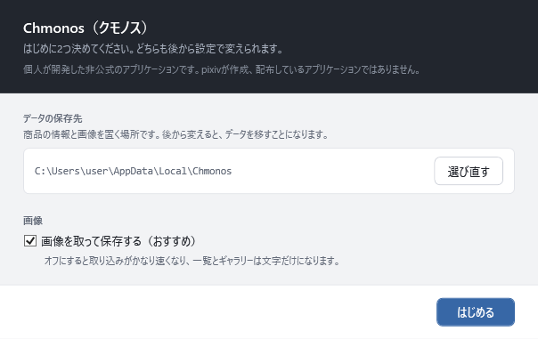

# はじめに

<!-- nav:top -->
[← 目次へ](README.md)
<!-- /nav:top -->

この章では、Chmonos をダウンロードして、初めて起動するまでを説明します。終わると、空のライブラリが表示された状態になります。

## 用意するもの

- Windows の 64bit 版の PC。Mac・スマートフォンでは使えません。確かめているのは Windows 11 です（Windows 10 では確かめていません）
- BOOTH でダウンロードしたアセット（zip など）。ダウンロードした場所から動かさなくて構いません
- インターネットへの接続。取り込んだ商品の情報と画像を BOOTH から取得します

BOOTH のアカウントやパスワードは使いません。ログインする画面もありません。

## 1. ダウンロードして展開する

1. [GitHub の Releases](https://github.com/kumo-mayu/chmonos/releases) か [BOOTH](https://kumo-mayu.booth.pm/items/8952335) から、`Chmonos-v1.0.0.zip` をダウンロードします
2. zip を右クリックして「すべて展開」を選び、好きな場所に展開します

展開すると、`Chmonos-v1.0.0` フォルダの中に `Chmonos.exe` と `assets` フォルダなどが並びます。

> **zip の中から直接開かないでください。**`assets` フォルダには、検索に使う辞書が入っています。zip の中から開くと、`assets` が使われないことがあります。
> `Chmonos.exe` だけを別の場所へ移すのも避けてください。移すときは、フォルダごと移します。

インストールは要りません。デスクトップなどから起動したいときは、`Chmonos.exe` を右クリックして「ショートカットの作成」を選び、できたショートカットを移してください。

## 2. 起動する

`Chmonos.exe` をダブルクリックします。

初めて起動するときに、Windows の警告が出ることがあります。`Chmonos.exe` にコード署名をしていないためです。

- **「Windows によって PC が保護されました」**（SmartScreen）と出たときは、「詳細情報」を押すと「実行」のボタンが出ます。「実行」を押すと起動します
- **「スマート アプリ コントロール」にブロックされた**ときは、警告の画面から起動する方法がありません。起動するには、「Windows セキュリティ」→「アプリとブラウザー コントロール」→「スマート アプリ コントロールの設定」で、スマート アプリ コントロールをオフにします
  - オフにすると、ほかのアプリにもこの保護が働かなくなります。オフにするかはご自身で判断してください
  - 2026年4月の更新（KB5083769）より前の Windows 11 では、一度オフにすると、Windows を再インストールしないとオンに戻せません

## 3. 保存先と画像を決める

初めて起動すると、2つのことを聞くウィンドウが出ます。どちらも、あとから設定で変えられます。

**データの保存先**

商品の情報と画像を保存する場所です。既定は `%LOCALAPPDATA%\Chmonos`（C ドライブのユーザーのフォルダの中）です。

- C ドライブの空きが少ないときは、「選び直す」でほかのドライブを選んでください。選んだ場所の中に `Chmonos` フォルダを作って、そこを使います
- 前に使っていたデータがある場所を選ぶと、そのデータの続きから始まります

アセットの zip そのものは、ここへはコピーしません。ファイルは今ある場所のまま管理します。

**画像**

「画像を取って保存する（おすすめ）」は、商品の画像を BOOTH から取得して保存する設定です。

- オンのままにすると、一覧やギャラリーに商品の画像が出ます
- オフにすると取り込みがかなり速くなりますが、一覧とギャラリーは文字だけになります。取り込みにかかる時間の多くは、画像の取得です

決めたら「はじめる」を押します。

## 起動できたかの確かめ

左にナビ（検索・改変・ショップ…）、右に「取り込み」の画面が出れば完了です。まだ何も取り込んでいないので、最初は取り込みの画面から始まります。
商品を取り込んだあとは、起動すると検索の画面が開きます。

次は [アセットを取り込む](02-import.md) に進みます。

## うまくいかないとき

| こうなった | 確かめること |
|---|---|
| ダブルクリックしても何も出ない | スマート アプリ コントロールにブロックされていないか（上の「2. 起動する」）。Windows の通知に出ていることがあります |
| 「既に起動しています。」と出る | 同じ保存先を使う Chmonos は、同時に2つ起動できません。タスクバーに Chmonos が無いかを確かめます |
| 「保存先に書けません」と出る | 選んだ場所に書き込む権限がありません。ドキュメントやほかのドライブなど、書き込める場所を選び直します |
| 「辞書などのファイルが見つかりません。」と出る | zip の中から開いたか、`Chmonos.exe` だけを移しています。zip を「すべて展開」して、展開したフォルダの `Chmonos.exe` を開きます |

<!-- nav:bottom -->

---

[次の記事：アセットを取り込む →](02-import.md)
<!-- /nav:bottom -->

<!-- 画像：first-run-short-path（ViewShot） -->
