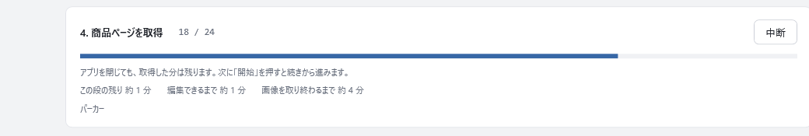
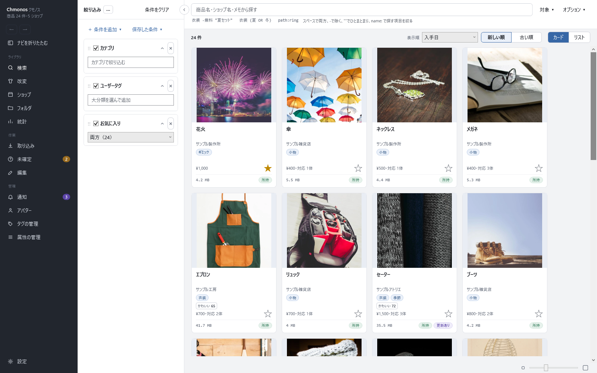
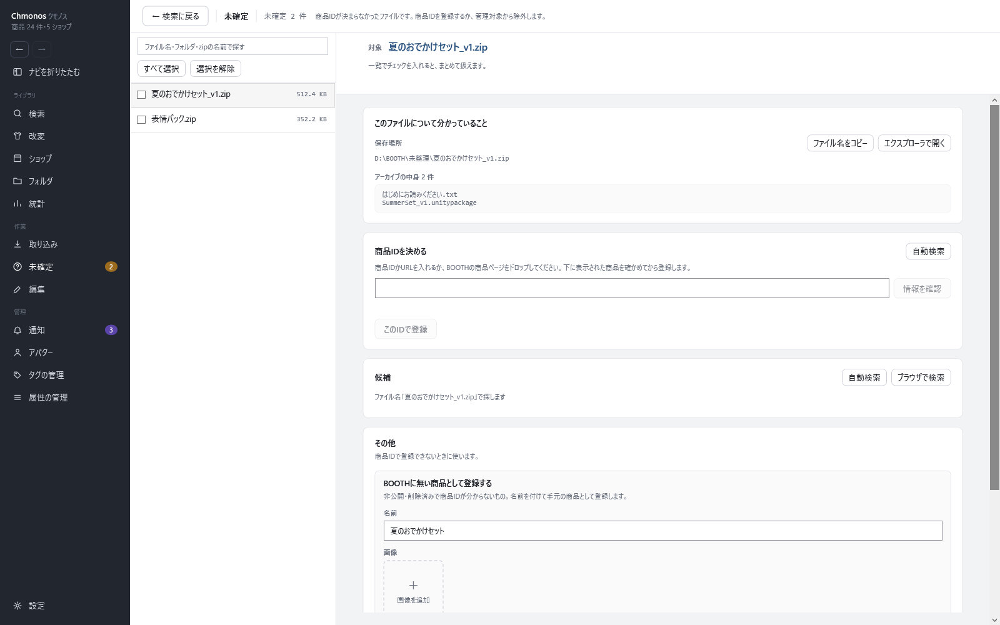

# アセットを取り込む

<!-- nav:top -->
[← 目次へ](README.md)　｜　[← 前の記事：はじめに](01-start.md)
<!-- /nav:top -->

前の章で Chmonos を起動できたら、次は手元のアセットを取り込みます。取り込むと、ファイルがどの BOOTH の商品かを調べ、商品名・ショップ・説明・画像を BOOTH から取得して記録します。
ファイルは移動もコピーもしません。今のフォルダの並びのまま使えます。

## 1. ファイルかフォルダをドラッグ＆ドロップする

BOOTH でダウンロードした zip か、zip を置いているフォルダを、Chmonos のウィンドウにドラッグ＆ドロップします。どの画面に落としても構いません。

- ドロップすると、すぐに取り込みが始まります。画面は切り替わらず、ウィンドウの下に進み具合と「取り込み画面を開く」が出ます
- 取り込みの画面では、上の枠にドロップするか、「フォルダを選択」でフォルダを選んでも取り込めます
- 取り込みの最中にドロップした分は、今の取り込みに追加されます

フォルダをドロップすると、「監視対象に入れますか」と聞かれることがあります。監視対象に入れたフォルダは、次に起動したときに、新しいファイルが増えていないかを調べます。BOOTH で買ったアセットを置いているフォルダを入れておくと便利です。
Windows の「ダウンロード」フォルダのように、BOOTH 以外のファイルも入るフォルダは入れないでください。アセットではないファイルが、未確定に大量に並びます。

> ドロップしてすぐ取り込みを始めたくないときは、設定の「取り込みと取得」で「ファイルやフォルダをドロップしたら、そのまま取り込みを始める」をオフにします。オフにすると、ドロップした物は「取り込み対象」に並び、「開始」を押すまで始まりません。

### 取り込むファイル

フォルダをドロップしたときに取り込むのは、BOOTH で配られる形式（zip・rar・画像・PSD・PDF・音声・動画・VRM・VRoid など）と、unitypackage・7z・blend・fbx です。
それ以外のファイルは、商品ページの「追加…」から商品に追加できます（[商品ページ](11-item.md)）。

zip のままで持っておくのがおすすめです。zip を展開してできたフォルダが zip と同じ場所にあるときは、zip と同じ商品として扱います。

## 2. 取り込みが終わるのを待つ

取り込みは段に分かれて進みます。取り込みの画面では、今の段と件数、残りの時間の見込みが出ます。

- **「編集できるまで」**：商品名・ショップ・説明がそろうまでの時間です。そろった商品から、検索で探せます
- **「画像を取り終わるまで」**：全部の画像を取得し終わるまでの時間です

時間がかかるのは、BOOTH へのリクエストを1件ずつ、1.5秒以上の間隔を空けて送っているためです。BOOTH を運営するピクシブ株式会社のサーバーに負担をかけないためで、速くする設定はありません。
100商品あたり、少なくとも次の時間がかかります。

| そろう物 | 100商品あたりの時間 |
|---|---|
| 商品名・ショップ・説明 | 約5分以上 |
| 画像（全部） | 約30分以上 |

取り込みの途中でも、ほかの画面で作業できます。途中でアプリを閉じても、取得した分は残ります。次に起動すると、画像の残りは自動で取得し、商品の情報の残りは、画面の下の「続きから進む」で続けられます。

## 3. 結果を確かめる

取り込みが終わると、取り込みの画面の「結果」に、スキャンしたファイルの数や、新しく取得した商品の数が出ます。

- 「取り込んだ商品を検索で開く」を押すと、取り込んだ商品が新しい順に並びます
- 商品が決まらなかったファイルがあるときは、「未確定」の数が出ます。次の「4. 商品が決まらなかったファイルを登録する」へ進みます

## 4. 商品が決まらなかったファイルを登録する

どの商品か決まらなかったファイルは、左のナビの「未確定」に並びます。ナビの「未確定」の横の数が、残りの件数です。

左の一覧からファイルを選び、右で商品を決めます。

**候補から選ぶ**

1. 「自動検索」を押します。ファイル名で BOOTH を検索して、「候補」に並べます
2. 合っていそうな候補の「これで確認」を押します。上の「商品IDを決める」に、その商品の名前と画像が出ます
3. 合っていれば「このIDで登録」を押します

候補の商品ページをブラウザで確かめたいときは、候補の「BOOTHで開く」を押します。

**商品IDか URL を入れる**

候補に無いときは、BOOTH の商品ページの URL（`https://〇〇.booth.pm/items/1234567` など）か商品ID（`1234567`）を入れて、「情報を確認」を押します。ブラウザで開いている BOOTH の商品ページのリンクを、欄にドラッグ＆ドロップしても入ります。
出てきた商品を確かめて、「このIDで登録」を押します。

キーボードだけで進めるときは、欄で Enter を押すと確認、Ctrl+Enter で登録して次のファイルへ進みます。

**そのほかの場合**

| こんなとき | すること |
|---|---|
| アセットではないファイル（自分で作ったメモなど）だった | 「除外する」を押します。一覧から外れます。設定の「隠したもの」から戻せます |
| 1つのフォルダ（zip を展開したフォルダなど）に、別々の商品のファイルが入っている | 同じフォルダのファイルは、まとめて1つの対象になります。上の「対象」の帯で「このファイルだけ」に切り替えてから、ファイルごとに登録します |
| BOOTH で非公開・削除済みになっていて、商品IDが分からない | 「その他」の「BOOTHに無い商品として登録する」で、名前を付けて登録します。画像も追加できます |
| zip を展開したフォルダの中身が、ばらばらに並んだ | 元の zip が一覧にあれば、帯の「元zipとして扱う」で zip にまとめて登録します。zip が無いときは「zipの代わりにフォルダを登録する」でフォルダごと登録します |

登録が済んだら、未確定の画面の上の「確定したものを編集する」で、登録した商品にユーザータグなどを入れられます（[整理して記録する](05-record.md)）。入れなくても、検索や Unity へのインポートはそのまま使えます。

## 取り込めたかの確かめ

左のナビの「検索」を開き、取り込んだ商品のカードが並んでいれば完了です。カードに画像が無い商品は、画像の取得がまだ終わっていません。しばらくすると出ます。

次は [探す](03-find.md) に進みます。

## 商品が自動で決まらない理由

Chmonos は、ダウンロードしたときにブラウザがファイルに記録する「ダウンロード元の情報」（Zone.Identifier）と、zip の中の文書にある商品の URL を手掛かりに、商品を決めます。

- Chrome・Edge でダウンロードした物は、ダウンロード元から商品を決められることを確かめています
- Firefox や、Chromium ベースのブラウザ（Vivaldi・Opera など）もダウンロード元を記録しますが、商品を決められる形かはまだ確かめていません

次の場合は、ダウンロード元の情報が残らないか、商品を決められない形になります。ファイル名で候補を探して、選んで登録します。

- Brave でダウンロードした（Brave はダウンロード元の URL を記録しません）
- シークレットウィンドウ・InPrivate・プライベートウィンドウでダウンロードした
- 7-Zip などで展開した中身だけを取り込んだ（展開ソフトの設定によっては情報が失われます）
- USB メモリなどにコピーした（FAT32・exFAT ではこの情報が保持されません）

最も確実なのは、Chrome か Edge の通常のウィンドウでダウンロードし、zip のまま取り込むことです。

## うまくいかないとき

| こうなった | 確かめること |
|---|---|
| 「取り込めなかった」件数が結果に出た | ダウンロード中のファイルや、ほかのアプリが開いているファイルは取り込めません。結果に出る原因を解消してから、もう一度ドロップします |
| OneDrive のフォルダの物が取り込まれない | 「オンラインのみ」のファイルは読み込みません（読むとダウンロードが始まるためです）。フォルダを「常にこのデバイスに保持する」にしてから、取り込み直します |
| 未確定に「壊れたzip」と出る | ダウンロードが途中で切れているなどで、zip を開けません。BOOTH からダウンロードし直して、もう一度取り込みます |
| 未確定に「BOOTHで非公開」と出る | 読み取れた商品IDが、BOOTH で見つかりませんでした。そのIDのまま登録すると、BOOTH で再び公開されたときに情報を取得します |
| 取り込みの途中で止まった | ネットにつながっていないか、BOOTH が応答していない可能性があります。つながってから、画面の下の「続きから進む」を押します |
| ファイルを移したら「見つかりません」になった | zip などのファイルは、移動や名前の変更をしても記録はそのまま使えます（中身で見分けています）。フォルダとして登録した物を移したときは、取り込みの画面の「見つからないファイルを探す…」で紐付け直します |

<!-- nav:bottom -->

---

[次の記事：探す →](03-find.md)
<!-- /nav:bottom -->

<!-- 画像：showcase-import（進み具合を切り抜き）・showcase-search・showcase-resolve（ViewShot） -->
