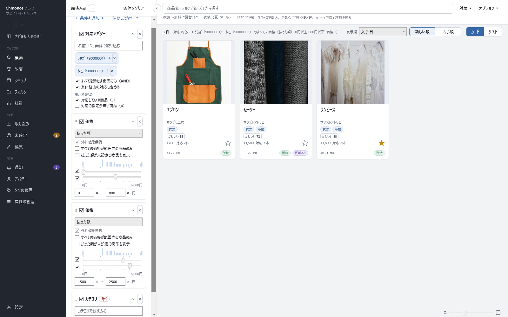
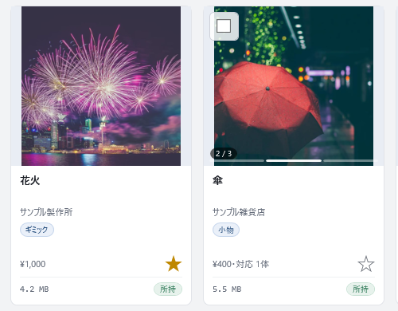
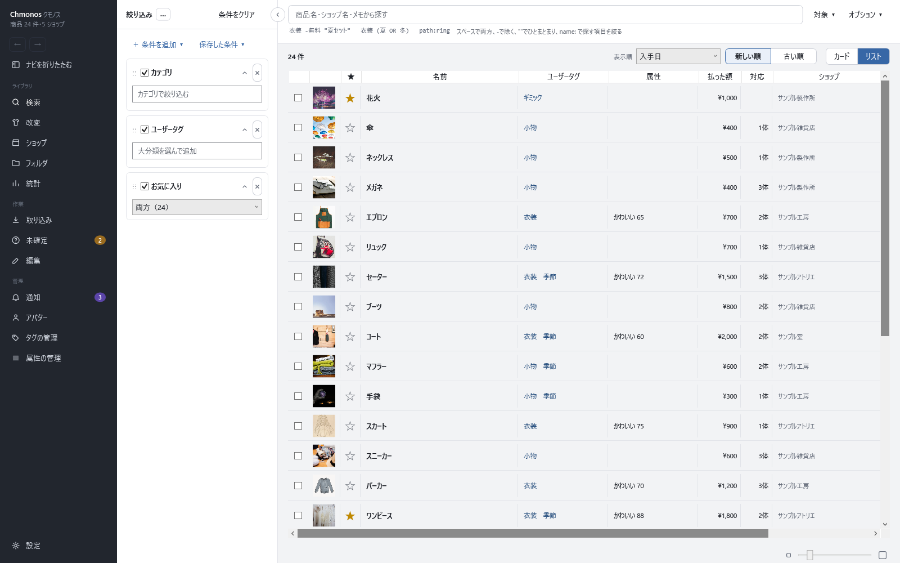

# 探す

取り込んだ商品は、何を手掛かりに探すかで、使う画面が変わります。

| 手掛かり | 使う画面 |
|---|---|
| 商品名・タグ・対応アバター・価格などの条件 | 検索 |
| PC のどのフォルダに置いたか | フォルダ |
| どのショップの物か | ショップ |
| どのアバター向けか・どの改変に使ったか | アバター・改変 |

この章では、まず一番よく使う検索の画面で、文字で探す・条件で絞り込む・並べ方を変える、を説明します。そのあと、ほかの画面からの探し方を説明します。
検索の画面のボタンや条件を全部知りたいときは、[検索の画面](10-search.md) を見てください。

## 文字で探す

画面の上の検索欄に、探したい語を入れます。入れたそばから一覧が絞られます。

既定で探すのは、商品名・ショップ名・メモの3つです。説明文やファイルの場所でも探したいときは、検索欄の右の「対象」で探す所を選びます。

| 入れ方 | 見つかる物 |
|---|---|
| `衣装 夏` | 「衣装」と「夏」の両方を含む物（スペースで区切ると両方） |
| `衣装 -無料` | 「衣装」を含み、「無料」を含まない物（`-` で除く） |
| `"夏セット"` | 「夏セット」というひとまとまりを含む物 |
| `衣装 (夏 OR 冬)` | 「衣装」を含み、「夏」か「冬」のどちらかを含む物 |
| `path:ring` | ファイルの場所に「ring」を含む物（前に `name:` などを付けると、探す所を1つに絞れます） |

付けられる前置きは、`name:`（商品名）・`shop:`（ショップ名）・`memo:`（メモ）・`main:`（本文）・`tag:`（BOOTHタグ）・`variation:`（バリエーション名）・`id:`（商品ID）・`file:`（ファイル名）・`path:`（ファイルの場所）・`content:`（zip の中のファイル名）・`subdomain:`（サブドメイン）です。

**表記をまたいで探す**

「オプション」の「別表記でも検索」を入れると、かな・漢字・ローマ字・英語をまたいで探せます。「スカート」で「skirt」、「shark」で「サメ」、「tori」で「鳥」が見つかります。
入れていないときに1件も見つからないと、一覧に「別表記でも検索する」のボタンが出ます。

## 条件で絞り込む

左の「絞り込み」に条件を足して、商品を絞ります。

1. 「＋ 条件を追加」を押し、条件の種類を選びます。「BOOTHの情報」「商品の情報」「ファイルの情報」などの見出しの下に並んでいます
2. 足した条件の中で、値を選ぶか入れます
3. ほかの条件も同じように足します。種類の違う条件は、全部を満たす商品だけが残ります

上の例は、次の4つの条件を組み合わせています。

- **対応アバター**：うさぎとねこを選び、「すべてを満たす商品のみ（AND）」を入れる → 両方に対応する商品
- **価格**（1つ目）：0〜800円
- **価格**（2つ目）：1,500〜2,500円。同じ種類の価格を2つ置くと、どちらかに入る商品が残ります
- **カテゴリ**：3D装飾品を選び、「除く」にする → 3D装飾品ではない商品

よく使う条件の例です。

| 探したい物 | 足す条件 |
|---|---|
| 持っているアバターに対応する衣装 | 対応アバター・カテゴリ |
| 自分で付けたタグの物 | ユーザータグ |
| お気に入りにした物 | お気に入り |
| 最近 Unity へ送った物 | 最近 |
| ある改変に使った物 | 改変 |
| 販売終了・非公開になった物 | 公開状況 |

**条件を操作する**

- 条件の左のチェックを外すと、値を残したまま一時的に効かなくなります。× で条件を外します
- 条件の「…」か右クリックで「当てはまる商品を除く」を選ぶと、その条件に当てはまる商品を除きます
- 絞り込みの上の「…」→「条件をクリア」で、全部の条件を外します

**検索を保存する**

組み合わせた検索は、「保存した条件」→「＋ 今の検索を保存」で、名前を付けて残せます。検索欄の文字・条件・表示順・カードかリストかをまとめて保存し、呼び出すと今の検索と置き換わります。

## 並べ方と見た目を変える

- **表示順**：一覧の上の「表示順」で、入手日・払った額・公開日・名前・ショップ・カテゴリ・容量などを選び、隣で「新しい順」「古い順」を切り替えます。値が無い商品は、どちらの向きでも後ろに並びます
- **カードとリスト**：一覧の右上の「カード」「リスト」で切り替えます。リストは、価格やショップを1行で見比べたいときに向いています
- **大きさ**：一覧の右下のスライダーで、カードの大きさとリストの行の高さを変えます

**カードの画像をめくる**

画像が2枚以上ある商品は、カードの画像の上でマウスを左右に動かすと、画像が切り替わります。画像の下の区切りと「2 / 3」のような表示で、何枚目かが分かります。

カードの星を押すと、お気に入りになります。カードを押すと、商品ページが開きます（[商品ページ](11-item.md)）。

**リストで見る**

一覧の右上の「リスト」を押すと、1行に1商品が並ぶ表示になります。名前・ユーザータグ・属性・払った額・対応アバターの数・ショップが列にそろうので、たくさんの商品を見比べたいときに向いています。

行の左の画像にマウスを乗せると、画像が大きく出ます。行を押すと、カードと同じく商品ページが開きます。「カード」を押すと元の表示に戻ります。

## ほかの画面から探す

フォルダやショップの画面には「〇〇の商品を検索で開く」のボタンがあり、そこから検索の画面に移って、さらに絞り込めます。

### フォルダ：置いた場所で探す

左のナビの「フォルダ」を開くと、取り込んだファイルを、PC のフォルダの並びのまま見られます。左にフォルダの木、右に選んだフォルダの商品が並びます。

- 未確定のファイルにも印が付いています
- 「このフォルダの商品を検索で開く」で、そのフォルダの商品だけを検索の画面で開きます

詳しくは [フォルダの画面](15-folders.md) にあります。

### ショップ：作者で探す

左のナビの「ショップ」を開くと、持っている商品がショップごとにまとまります。ショップのカードを押すと、そのショップの持っている商品が並びます。「このショップの商品を検索で開く」で検索の画面へ移れます。
商品ページのショップ名を押しても、そのショップが開きます。詳しくは [ショップの画面](18-shops.md) にあります。

### アバター・改変：使い道で探す

- **アバター**：左のナビの「アバター」に、持っているアバターと、それぞれに対応する商品の数が並びます。そのアバターに対応する衣装を探すときは、検索の「対応アバター」の条件を使います（上の「条件で絞り込む」）
- **改変**：左のナビの「改変」で改変を選ぶと、その改変に使った商品が並びます（[改変の画面](16-modifications.md)）

## 見つかったかの確かめ

探している商品のカードが一覧に出れば完了です。カードを押して商品ページを開き、次の [Unity へインポートする](04-unity.md) に進みます。

## うまくいかないとき

| こうなった | 確かめること |
|---|---|
| 「該当するものがありません」と出る | 絞り込みに、前に足した条件が残っていないか。絞り込みの上の「…」→「条件をクリア」で全部外して、探し直します |
| 説明文に書いてある語で見つからない | 既定では説明文を探しません。「対象」で「本文（説明とセクション）」を入れます |
| 表記の違う語で見つからない | 「オプション」の「別表記でも検索」を入れます |
| 対応アバターで絞ると、対応しているはずの商品が出ない | 対応アバターは商品の説明やタグから読み取るので、読み取れていないことがあります。商品ページで対応アバターを足せます（[商品ページ](11-item.md)） |
| 非表示にした商品が出ない | 非表示の商品は、検索に出ません。「＋ 条件を追加」の「非表示」を足すと出ます |

<!-- 画像：showcase-filters・showcase-search-hover（傘のカードを切り抜き）・showcase-list・showcase-folder（ViewShot） -->
