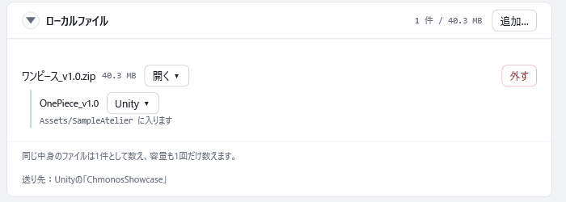
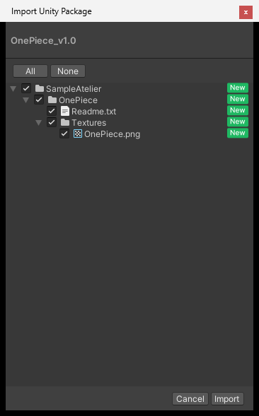
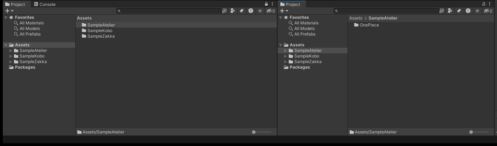
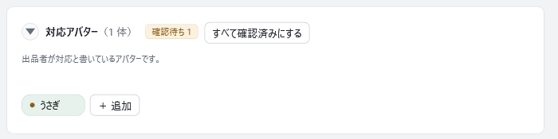

# Unity へインポートする

<!-- nav:top -->
[← 目次へ](README.md)　｜　[← 前の記事：探す](03-find.md)
<!-- /nav:top -->

探した商品を、開いている Unity のプロジェクトへインポートします。zip を自分で展開する必要はありません。
この章では、商品ページから Unity へ送る・インポートした場所を Unity で開く・対応アバターを確かめる、の3つを説明します。

## 用意するもの

- Unity のエディタで開いた、インポート先の Unity のプロジェクト。確かめているのは Unity 2022.3 です
- Chmonos に登録した商品の zip で、中に unitypackage が入っている物（ファイルが見つからないときは [うまくいかないとき](#うまくいかないとき)）

## 1. 商品ページの「Unity ▾」から送る

1. 検索で商品のカードを押して、商品ページを開きます
2. 右の「ローカルファイル」の欄に、手元のファイルと、その中の unitypackage が並びます。送りたい unitypackage の行の「Unity ▾」を押します
3. 「Unityへ送る」を選びます
4. 「〇〇を、Unityの「△△」に送ります。」と出るので、OK を押します

unitypackage の行の下には、プロジェクトのどこに入るか（「Assets/〇〇 に入ります」）が出ます。欄の下の「送り先」は、今開いている Unity のプロジェクトです。

Unity のエディタが2つ以上開いているときは、どれに送るかを聞かれます。

## 2. Unity でインポートする

送ると、Unity が前に出て、「Import Unity Package」のウィンドウが開きます。中身を確かめて「Import」を押します。

ここから先は、ふだん unitypackage をダブルクリックしてインポートするときと同じです。インポートをやめるときは「Cancel」を押します。

## 3. インポートした場所を Unity で開く

「Unity ▾」の「Unityで選択」を押すと、Unity の Project ウィンドウで、その商品が入ったフォルダが選ばれます。
衣装を着せる前に、どこに入ったかを探す手間が省けます。

プロジェクトの場所は、Unity Hub か VCC（または ALCOM）のプロジェクトの一覧から調べます。どちらの一覧にも無いプロジェクトでは使えません。

まだインポートしていない物で押すと、「まだ入っていません」と知らせます。

## 4. 対応アバターを確かめる

商品ページの「対応アバター」の欄には、その商品が対応しているアバターが並びます。商品の説明やタグから自動で読み取った物です。

- 説明文のリンクなど、確かでない手掛かりから読み取った物には、「確認待ち」の札が付きます。合っていれば札の ✓ で確認済みにし、違っていれば右クリックの「外す」で外します。「すべて確認済みにする」で、まとめて確認済みにもできます
- 読み取れなかったアバターは、「＋ 追加」で名前を入れて足せます
- 外した物は、もう一度読み取っても戻りません。外すと欄の下に「消したもの n 件」が出るので、戻すときはそこから「戻す」を押します

対応アバターは、検索の絞り込みの「対応アバター」で使います（[探す](03-find.md)）。持っているアバターの一覧は、左のナビの「アバター」で見られます（[アバターの画面](17-avatars.md)）。

## いくつかの商品をまとめて送る

検索の画面で、カードの左上のチェックを入れて商品を選ぶと、画面の下に選んだ商品の操作が出ます。「Unityへ順に送る…」を押すと、1件ずつ順に送ります。Unity で1件インポートし終わると、次の1件が出ます。

改変に使った物をまとめて送るときは、改変の画面の「使ったものを順にUnityへ送る」を使います（[整理して記録する](05-record.md)）。

## インポートできたかの確かめ

Unity の Project ウィンドウに、送った商品のフォルダが増えていれば完了です。

次は [整理して記録する](05-record.md) に進みます。

## うまくいかないとき

| こうなった | 確かめること |
|---|---|
| 「Unityが開いていません」と出る | Unity のエディタでプロジェクトを開いてから、もう一度押します。Unity Hub だけが開いている状態では送れません |
| 「Unity ▾」が出ない | その行に unitypackage がありません。zip の中に unitypackage が入っていない商品（テクスチャだけの物など）は、「開く ▾」から開いて使います |
| 「Unityで選択」で「中を調べられません」と出る | プロジェクトが Unity Hub か VCC の一覧に入っていないと、場所が分かりません。Unity Hub の「追加」で、プロジェクトを一覧に足します |
| 「Unity ▾」を押せない・「見つかりません」と出る | zip を移したか消したかで、手元に見つかりません。移した先を取り込むと、この商品に付け直します |
| 違うプロジェクトに送られそう | 送る前の確かめの窓に、送り先のプロジェクト名が出ます。違っていればキャンセルして、送りたいプロジェクトのエディタを開きます |

<!-- nav:bottom -->

---

[次の記事：整理して記録する →](05-record.md)
<!-- /nav:bottom -->

<!-- 画像：showcase-item（--height 1500 でローカルファイルの欄を切り抜き）・showcase-item-confirm（対応アバターの欄を切り抜き）・Unity の実機（空のプロジェクト ChmonosShowcase で撮った Import Unity Package と、Unityで選択の Project ウィンドウ。ChmonosShowcase は VCC の一覧に足してある）（ViewShot） -->
