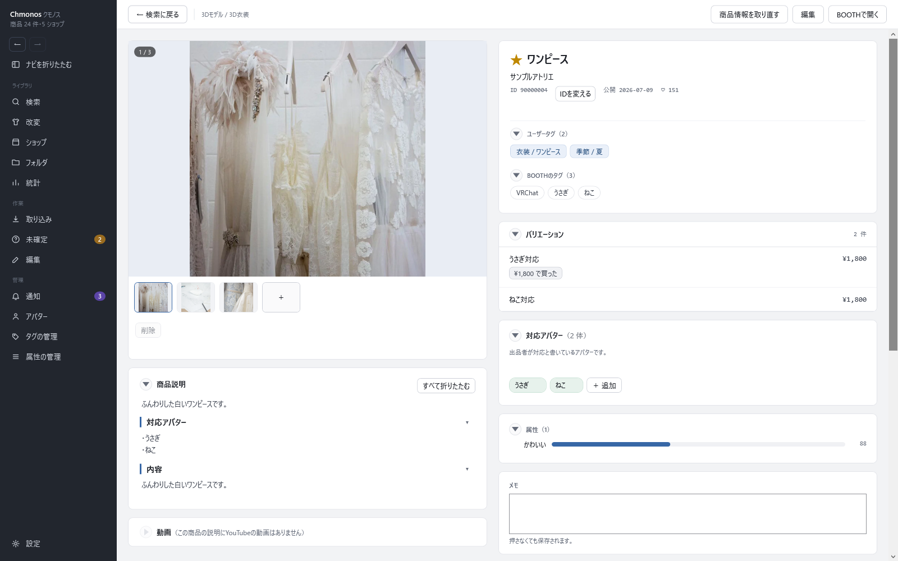

# 商品ページ

<!-- nav:top -->
[← 目次へ](README.md)　｜　[← 前の記事：検索の画面](10-search.md)
<!-- /nav:top -->

検索などでカードを押すと開く、1つの商品の情報をまとめた画面です。左に画像と説明、右に自分の記録と手元のファイルが並びます。

## 上の帯

| ボタン | すること |
|---|---|
| ← 検索に戻る | 前の画面に戻ります（Alt+← やマウスの戻るボタンでも戻れます） |
| 商品情報を取り直す | BOOTH から商品の情報を取得し直します |
| 編集 | この商品だけを編集の画面で開きます（[編集の画面](12-edit.md)） |
| BOOTHで開く | 商品ページをブラウザで開きます |

## 左：画像と説明

**画像**

- 大きな画像の左上に「1 / 3」のように、何枚目かが出ます。下の小さな画像を押すと切り替わります
- 「＋」で、自分の画像を足せます。画像をドラッグ＆ドロップするか、Ctrl+V で貼り付けても足せます
- 小さな画像を右クリックすると、「この画像をサムネイルにする」（カードに出す画像にする）・「前へ移動」「後ろへ移動」（並べ替え）・画像の種類（BOOTH・改変例・その他）を選べます
- 自分で足した画像は「削除」か右クリックの「この画像を削除」で消せます。BOOTH の画像は消せません
- 画像の取得が終わっていないときは、「画像取得を優先」で、この商品の画像を先に取得します

BOOTH から消えた画像は、既定では出しません。設定の「BOOTHから消えた画像も表示する」を入れると、「削除済」として並びます。

**商品説明**

BOOTH の商品ページの説明です。見出しごとに畳めます。「すべて折りたたむ」で全部を畳みます。
説明の中の BOOTH の商品へのリンクは、持っている商品ならアプリの中の商品ページへ移ります。

**動画**

説明に載っている YouTube の動画を、画像とタイトル付きのリンクで並べます。押すとブラウザで開きます。

## 右：自分の記録

| 欄 | 中身 |
|---|---|
| 名前の行 | 星（お気に入り）・商品名・ショップ名（押すとショップの画面へ）・ID・公開日・スキ数 |
| IDを変える | 間違った商品に登録したときに、別の商品IDへ移します。記録はそのまま移ります |
| ユーザータグ | 自分で付けたタグ（「大分類 / 小分類」）。付けるのは編集の画面で |
| BOOTHのタグ | BOOTH で付いているタグ |
| バリエーション | BOOTH のバリエーションと価格。買った物には「¥1,800 で買った」のような札が付きます |
| 対応アバター | 対応しているアバター。確認待ちの確かめ方は [Unity へインポートする](04-unity.md#4-対応アバターを確かめる) |
| 属性 | 自分で付けた属性の値 |
| メモ | 自由に書けます。押さなくても保存されます |

## ローカルファイル

この商品の手元のファイルです。

| 部分 | すること |
|---|---|
| 追加… | ファイルを選んで、この商品に紐付けます。種類を問わず、何でも紐付けられます |
| 開く ▾ | 「エクスプローラで開く」（ファイルのある場所を開く）・「一時的に展開して開く」（zip を一時フォルダに展開して開く。アプリを閉じると消えます） |
| Unity ▾ | 中に unitypackage がある行に出ます。「Unityへ送る」「改変に追加して送る」「Unityで選択」（[Unity へインポートする](04-unity.md)） |
| 外す | このファイルを、この商品から外します。外したファイルは灰色で残り、「この商品に戻す」で戻せます |

商品ページに zip などをドラッグ＆ドロップすると、「この商品に紐付ける」「取り込む」を選べます。

**ファイルの行の札**

| 札 | 意味 |
|---|---|
| 見つかりません | 記録した場所にファイルがありません。移した先のフォルダを取り込むと、この商品に付け直します |
| 取り外しているドライブ | 外付けドライブなどがつながっていません。つなぐと開けます |
| 壊れたzip | zip を開けません。ダウンロードし直します |
| 外したファイル | この商品から外したファイルです。所持や容量には数えません |
| 古い版 | 同じ名前の新しい版で上書きされたファイルです |

## この商品を使った改変

この商品を使った改変が並びます。「開く」でその改変へ、「改変に追加」で今ある改変に足します（[整理して記録する](05-record.md#改変を記録する)）。

## 記録していること

入手日・最後に情報を取得した日・次に取得する予定の日・アバターを検出した日・BOOTH での販売の状態などが並びます。

## BOOTH で変わった所

BOOTH で商品が更新されたとき、まだ通知を読んでいなければ、変わった欄の左に色の線と札が付きます。足された所は緑、消えた所は赤、変わった所は橙です。
価格が変わったバリエーションには、「¥前 → ¥今」が出ます。通知の画面で既読にすると消えます（[通知の画面](20-inbox.md)）。

BOOTH で見つからなくなった商品には、「同じ商品をBOOTHで探す」が出ます。作者が商品を出し直したときに、新しい商品IDへ移せます。

<!-- nav:bottom -->

---

[次の記事：編集の画面 →](12-edit.md)
<!-- /nav:bottom -->

<!-- 画像：showcase-item・showcase-item（--height 1500 でローカルファイルの欄を切り抜き）（ViewShot） -->
