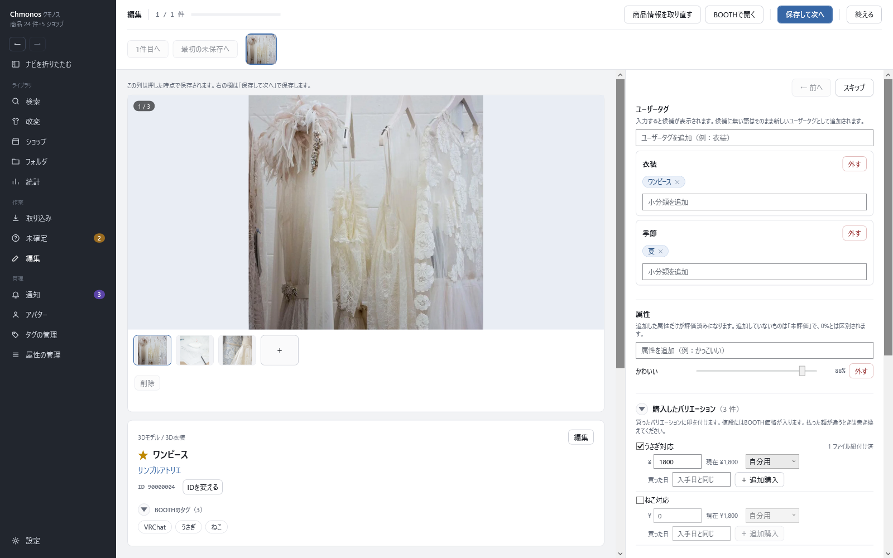

# 編集の画面

<!-- nav:top -->
[← 目次へ](README.md)　｜　[← 前の記事：商品ページ](11-item.md)
<!-- /nav:top -->

商品に、自分の記録（ユーザータグ・属性・買ったバリエーションなど）を入れる画面です。使い方の流れは [整理して記録する](05-record.md#ユーザータグと属性を付ける編集) にあります。

## 開き方と、出る商品

| 開き方 | 出る商品 |
|---|---|
| 左のナビの「編集」 | ユーザータグがまだ無い商品を、順に |
| 商品ページの「編集」・カードの右クリックの「編集画面を開く」 | その商品だけ |
| 検索で選んで「まとめて編集する」 | 選んだ商品を、順に |
| 未確定の画面の「確定したものを編集する」 | 未確定から登録した商品を、順に |

## 上の帯

| ボタン | キー | すること |
|---|---|---|
| 1件目へ・最初の未保存へ | | 順番の初めへ・まだ保存していない最初の商品へ移る |
| 続く商品の画像 | | 押すとその商品へ移る |
| BOOTHで開く | | 商品ページをブラウザで開く |
| 保存して次へ | Ctrl+Enter | 右の欄を保存して次の商品へ |
| 終える | | 編集を終える |

右の欄の上には「← 前へ」（Ctrl+P）と「スキップ」（Ctrl+N）があります。スキップは保存せずに次の商品へ進みます。
全部の商品を終えると、少し待って検索の画面に戻ります。「ここに留まる」を押すと戻りません。

## 左：商品の情報

左の列は、**押した時点で保存されます**（「保存して次へ」を待ちません）。

- 商品の画像と、商品ページと同じ説明・ローカルファイルの欄
- 説明の上の「編集」で、商品名・ショップ・ショップのURL・カテゴリを直せます。BOOTH に無い商品で使います
- 「IDを変える」で、別の商品IDへ移します
- 商品説明の欄の高さは、下の縁をドラッグして変えられます（ダブルクリックで元の高さ）

## 右：自分の記録

右の欄は、**「保存して次へ」で保存します**。

| 欄 | 入れ方 |
|---|---|
| ユーザータグ | 「ユーザータグを追加」に大分類を入れて Enter。できた枠の「小分類を追加」に小分類を入れて Enter。枠ごと消すときは「外す」 |
| 属性 | 「属性を追加」に名前を入れて Enter。スライダーで 0〜100% を決める。「外す」で消す |
| 購入したバリエーション | 買った物にチェック。値段（BOOTH の価格が入る）・「自分用」「貰った」「贈った」・買った日（空なら「入手日と同じ」）を入れる。同じ物を2回買ったときは「＋ 追加購入」 |
| バリエーション分け | 「ファイルごと」「バリエーションごと」で、どのファイルがどのバリエーションの物かを選ぶ |
| メモ | 自由に書く |
| 入手日 | 手に入れた日 |
| 更新を通知する | 外すと、BOOTH で更新されても通知に出ません |
| 非表示にする | 入れると、検索に出なくなります |
| アバター | 3Dキャラクター以外のカテゴリの商品を、アバターとして扱うときに「アバターとして登録」 |

入力欄に打ち始めると、前に使った名前が候補に出ます。↑↓ で選んで Enter で決めます。Tab は次の欄へ移ります。候補に無い語は、そのまま新しいタグ・属性になります。

属性は、追加した物だけが評価済みになります。追加していない物は「未評価」で、0% とは別に扱います。

<!-- nav:bottom -->

---

[次の記事：未確定の画面 →](13-resolve.md)
<!-- /nav:bottom -->

<!-- 画像：showcase-edit（ViewShot） -->
