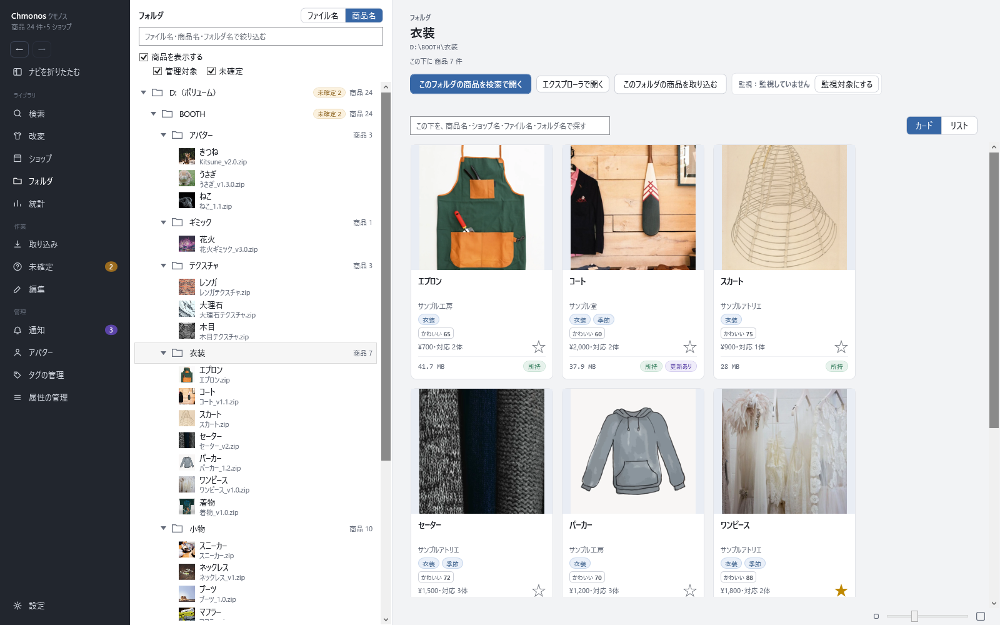

# フォルダの画面

取り込んだファイルを、PC のフォルダの並びのまま見る画面です。左のナビの「フォルダ」で開きます。

## 左：フォルダの木

取り込んだファイルのあるフォルダが、ドライブごとに木になって並びます。三角で開閉します。

| 部品 | すること |
|---|---|
| 上の欄 | ファイル名・商品名・フォルダ名で絞り込む |
| ファイル名・商品名 | ファイルの行を、ディスク上のファイル名で出すか、商品名で出すか（商品名のときは、ファイル名がその下に出ます） |
| 商品を表示する | 入れると、商品に紐付いたファイルも木に出します |
| 管理対象・未確定 | 商品に紐付いたファイル・フォルダと、商品が決まっていないファイル（「?」の印）を木に出すか |

「展開したフォルダあり」の印は、その zip を展開したフォルダが隣にあることを示します。押すと、そのフォルダをエクスプローラで開きます。
同じ中身のファイルが別の場所にもあるときは、そこへ移る印が出ます。

## 右：選んだ物

左でフォルダを選ぶと、その中の商品がカードで並びます。ファイルを選ぶと、そのファイルの商品ページが右に出ます。

| ボタン | すること |
|---|---|
| このフォルダの商品を検索で開く | そのフォルダ（下のフォルダも含む）の商品だけを、検索の画面で開く |
| このフォルダの商品を取り込む | そのフォルダを取り込む |
| エクスプローラで開く | そのフォルダを開く |
| 未確定として開く | フォルダの下の未確定のファイルを、未確定の画面で開く |
| 監視対象にする・監視をやめる | そのフォルダを監視対象にするか。今の状態は「監視中」「監視していません」で出ます（[取り込みの画面](14-import.md#監視対象)） |

フォルダの下に未確定のファイルがあるときは、「この下の未確定 n 件を管理対象から除外する」で、まとめて除外できます。

カードの操作は、検索の画面と同じです（[検索の画面](10-search.md#カード)）。

<!-- 画像：showcase-folder（ViewShot） -->
