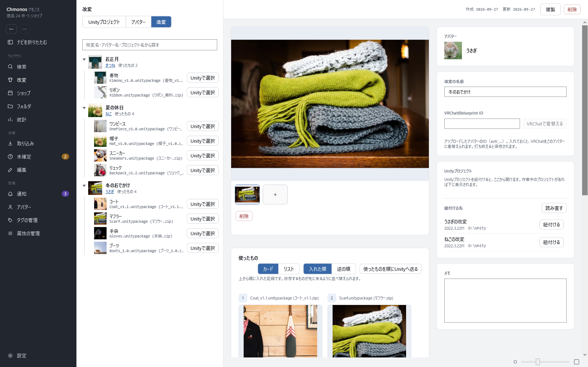

# 改変の画面

<!-- nav:top -->
[← 目次へ](README.md)　｜　[← 前の記事：フォルダの画面](15-folders.md)
<!-- /nav:top -->

改変（着せ替え1つ分の記録）を見る画面です。左のナビの「改変」で開きます。使い方の流れは [整理して記録する](05-record.md#改変を記録する) にあります。

## 左：一覧

上の3つのボタンで、並べ方を切り替えます。

| 見方 | 並び |
|---|---|
| Unityプロジェクト | プロジェクトごとに、紐付けた改変 |
| アバター | アバターごとに、そのアバターの改変。改変を作るのはここから |
| 改変 | 改変ごとに、使ったもの |

- 上の欄で、改変名・アバター名・プロジェクト名で探せます
- 使ったものの行の「Unityで選択」で、紐付けたプロジェクトでその商品が入った場所を示します。入っていなければ、送るかを聞きます
- 行を押すと、右に詳しく出ます
- 改変の行の右クリックの「複製」で、使ったものとメモが同じ改変を作ります

**Unityプロジェクトを選んだとき**：状態（開いているか）・バージョン・情報元（Unity Hub・VCC など）・最後に触った日と、「Unityを開く」「エクスプローラで開く」「VCCを開く」が出ます。

**アバターを選んだとき**：そのアバターの改変と、「新しい改変」の欄が出ます。名前を入れて「改変を作る」を押すと作れます。

## 右：改変の詳しい内容

| 欄 | 中身 |
|---|---|
| 上の帯 | 作った日・更新した日・「複製」・「削除」 |
| 写真 | 「＋」で選ぶか、ドラッグ＆ドロップか、Ctrl+V で足します。自分で足した写真は「削除」で消せます |
| アバター | この改変のアバター |
| 改変の名前 | 打つと保存されます |
| VRChatのblueprint ID | アップロードしたアバターのID（avtr_…）。入れると「VRChatで着替える」が押せます |
| Unityプロジェクト | 紐付ける先を選んで「紐付ける」。「読み直す」で、そのプロジェクトに入っている手元の商品を候補に出します |
| メモ | 次に作るときに要ることを書いておけます。打ち終えると保存されます |

**使ったもの**

この改変に入れた商品が、入れた順に並びます。

| 部品 | すること |
|---|---|
| カード・リスト | 見せ方の切り替え |
| 入れた順・逆の順 | 並べる向き。見せる順が変わるだけで、記録の順は変わりません |
| 使ったものを順にUnityへ送る | 入れた順に、1件ずつ Unity へ送る |
| 使ったものを商品名で探して追加 | 商品名を入れて「追加」で、最後に足す |
| 番号 | 入れた順。並べ替えると、依存する物が先に来るように直せます |

使ったものを外すと、薄く残って戻せます。外した行は「削除」で完全に消せます。
手元にファイルが無くなった商品は「手元にありません」と出ます。記録は残ります。

<!-- nav:bottom -->

---

[次の記事：アバターの画面 →](17-avatars.md)
<!-- /nav:bottom -->

<!-- 画像：showcase-modification（ViewShot） -->
