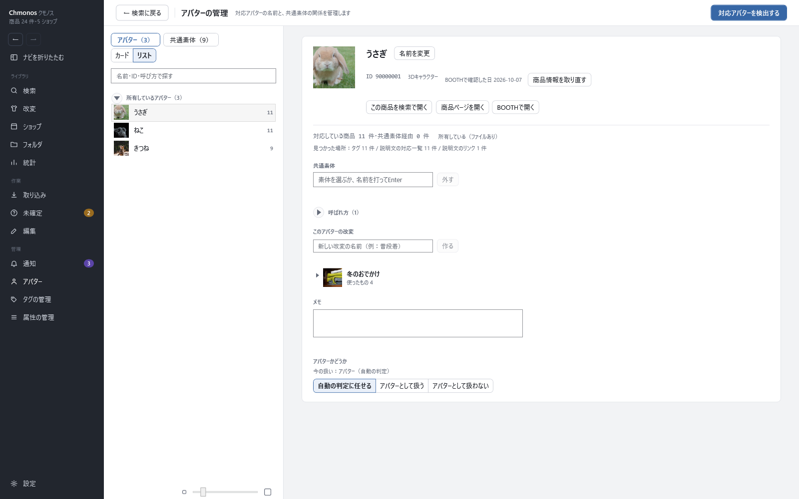

# アバターの画面

<!-- nav:top -->
[← 目次へ](README.md)　｜　[← 前の記事：改変の画面](16-modifications.md)
<!-- /nav:top -->

対応アバターの名前と、共通素体の関係を管理する画面です。左のナビの「アバター」で開きます。

対応アバターは、取り込んだ商品の説明文やタグから見つけます。ここで名前の呼び方や共通素体を整えると、見つけ方が良くなります。

## 上の帯

「対応アバターを検出する」で、取り込んだ商品の説明文などから、対応アバターを見つけ直します。

## 左：一覧

| 部品 | すること |
|---|---|
| アバター・共通素体 | アバターの一覧と、共通素体の一覧を切り替える |
| カード・リスト | 見せ方の切り替え |
| 上の欄 | 名前・ID・呼び方で探す |

アバターは「所有しているアバター」（手元にファイルがあるアバター）と、所有していないアバターに分かれて並びます。ファイルを持っていなくても、「所有しているものとして扱う」で所有に入れられます（「所有の指定を外す」で戻します）。カードの右上の数は、そのアバターに対応している商品の数です。

## 右：アバターを選んだとき

| 部分 | すること |
|---|---|
| 名前を変更 | 一覧に出す名前を変える。「BOOTHの名前に戻す」で戻します |
| 商品情報を取り直す | アバターの商品の情報を BOOTH から取り直す |
| この商品を検索で開く・商品ページを開く・BOOTHで開く | アバターの商品を開く |
| 対応している商品 | 対応している商品の数と、どこで見つけたか（タグ・説明文の対応一覧・説明文のリンク） |
| 共通素体 | このアバターの素体を選ぶか、名前を打って Enter。「外す」で外します |
| 呼ばれ方 | このアバターの別の呼び方。「呼び方を追加」で足すと、その呼び方でも対応を見つけます。「検出に使わない呼び方」に入れた物は使いません |
| このアバターの改変 | 名前を入れて「作る」で、改変を作ります |
| メモ | 自由に書けます |
| アバターかどうか | 「自動の判定に任せる」「アバターとして扱う」「アバターとして扱わない」 |

## 右：共通素体を選んだとき

共通素体（いくつかのアバターで共通の体）の名前と、その素体を使っているアバターを管理します。
同じ素体のアバター向けに作られた衣装は、「素体経由」として一緒に表示されます。

| 部分 | すること |
|---|---|
| 上の欄と「追加」 | 共通素体を足す |
| この素体を使っているアバター | アバターを足す・「この素体から外す」 |
| 素体の名前を含む商品 | 名前に素体の名前が入っている商品 |
| 素体の商品を設定 | 素体そのものの商品の ID か URL を入れる |

<!-- nav:bottom -->

---

[次の記事：ショップの画面 →](18-shops.md)
<!-- /nav:bottom -->

<!-- 画像：showcase-avatars（ViewShot） -->
