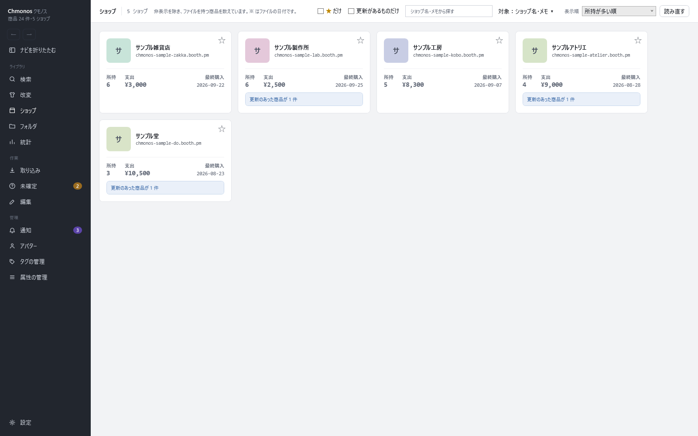

# ショップの画面

<!-- nav:top -->
[← 目次へ](README.md)　｜　[← 前の記事：アバターの画面](17-avatars.md)
<!-- /nav:top -->

持っている商品を、ショップごとにまとめて見る画面です。左のナビの「ショップ」で開きます。

非表示の商品を除いた、ファイルを持っている商品を数えています。

## 上の帯

| 部品 | すること |
|---|---|
| ★ だけ | 星を付けたお気に入りのショップだけを出す |
| 更新があるものだけ | 更新のあった商品があるショップだけを出す |
| 検索の欄・対象 | ショップ名・メモで探す |
| 表示順 | 所持が多い順など |
| 読み直す | 一覧を作り直す |

## ショップのカード

| 部分 | 意味・操作 |
|---|---|
| 星 | お気に入りのショップにする。検索の「ショップ」の条件で、お気に入りのショップの商品をまとめて選べます |
| 所持・支出・最終購入 | そのショップの持っている商品の数・払った額の合計・最後に買った日 |
| 更新のあった商品が n 件 | 押すと、その知らせを開きます |

カードを押すと、そのショップの画面が開きます。

## ショップを開いたとき

- バナー・アイコン・ショップのメモと、購入総額・容量が出ます
- 「このショップの商品」に、手元に情報がある商品が並びます。BOOTH の全商品ではありません。「所持しているものだけ」で、持っている物だけにします
- 「BOOTHのショップページを開く」でブラウザで開きます。「このショップの商品を検索で開く」で検索の画面へ移ります
- 「画像を取り直す」で、バナーとアイコンを取り直します

商品ページのショップ名を押しても、この画面が開きます。

<!-- nav:bottom -->

---

[次の記事：統計の画面 →](19-stats.md)
<!-- /nav:bottom -->

<!-- 画像：showcase-shops（ViewShot） -->
