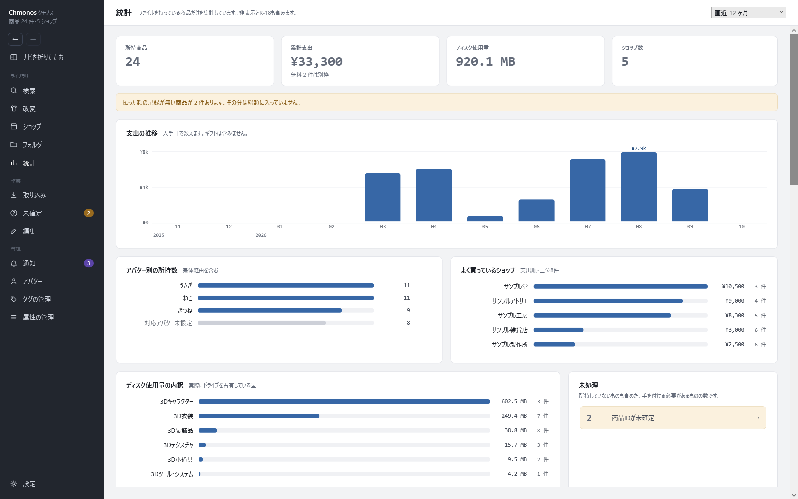

# 統計の画面

<!-- nav:top -->
[← 目次へ](README.md)　｜　[← 前の記事：ショップの画面](18-shops.md)
<!-- /nav:top -->

持っている商品の数・支出・容量などをまとめる画面です。左のナビの「統計」で開きます。

ファイルを持っている商品だけを数えます。非表示と R-18 の商品も含みます。右上で、数える期間（直近 12 ヶ月など）を選びます。

## 並ぶもの

| 欄 | 中身 |
|---|---|
| 所持商品・累計支出・ディスク使用量・ショップ数 | 上の4つの数。払った額の記録が無い商品があると、その件数が下に出ます |
| 支出の推移 | 月ごとの支出。入手日で数え、ギフトは含みません |
| アバター別の所持数 | 対応アバターごとの商品の数（素体経由を含む） |
| よく買っているショップ | 支出の多い順に上位8件 |
| ディスク使用量の内訳 | カテゴリごとの、実際にドライブを使っている量。同じ中身のファイルを2か所以上に置いている分（重複）と、空けられる場所も出ます |
| 未処理 | 未確定など、手を付ける必要がある物の数。押すとその画面へ移ります |
| 価格帯 | 価格ごとの数。無料で手に入れた物・ギフトでもらった物も分けて出ます |
| 買った時からの価格の動き | 買った時と今で BOOTH の価格が変わった商品 |
| カテゴリ・ユーザータグ | それぞれの支出と点数 |
| 点数の多いショップ・また買っているか | 支出順とは別の見方のショップの順位 |
| 容量の大きい商品 | 容量の大きい順 |
| 属性 | 属性ごとの値の分布。評価した商品だけを数えます |
| 軸どうしの関係 | 2つの値が一緒に動くかを −1〜+1 で表します |
| 所有アバターに着られるもの | 持っているアバターに対応している衣装など（素体経由は推定） |
| 手元の状態 | 買ったまま仕分けていない物・非表示にしている物・もう買えない物（手元にしか無いので、バックアップをおすすめします）・BOOTH に無い商品として登録した物 |
| スキ数の分布 | BOOTH のスキ数ごとの数 |

<!-- nav:bottom -->

---

[次の記事：通知の画面 →](20-inbox.md)
<!-- /nav:bottom -->

<!-- 画像：showcase-stats（ViewShot） -->
