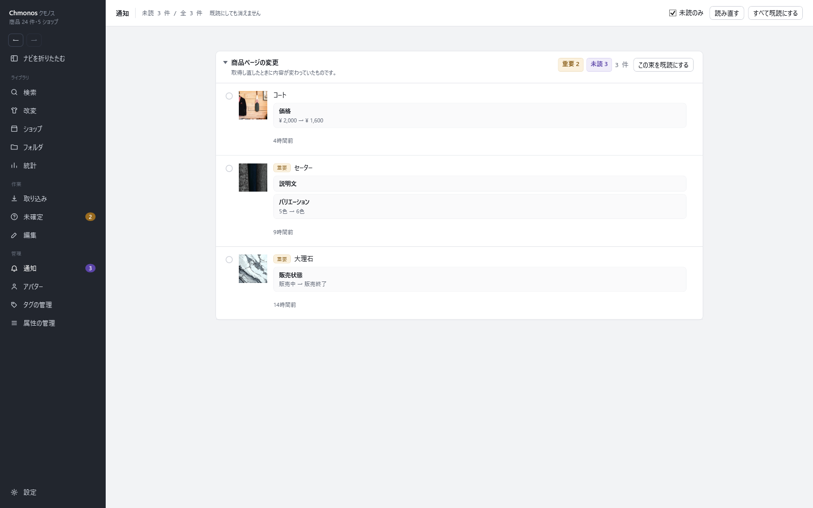

# 通知の画面

<!-- nav:top -->
[← 目次へ](README.md)　｜　[← 前の記事：統計の画面](19-stats.md)
<!-- /nav:top -->

持っている商品が BOOTH で変わったことを知らせる画面です。左のナビの「通知」で開きます。ナビの「通知」の横の数が、未読の件数です。

## 通知が来るとき

起動している間、Chmonos はしばらく確かめていない商品の情報を BOOTH から取り直します（既定ではおよそ1週間ごと）。前と変わっていたら、ここに出ます。

| 変わった所の例 | 出方 |
|---|---|
| 価格 | ¥2,000 → ¥1,600 |
| 説明文 | 足された行・消された行 |
| バリエーション | 5色 → 6色 |
| 販売状態 | 販売中 → 販売終了 |

大事な変更（販売終了・説明文の変更など）には「重要」の札が付きます。

## 操作

| 部品 | すること |
|---|---|
| 未読のみ | 入れると、未読の通知だけを出す |
| 読み直す | 一覧を作り直す |
| すべて既読にする | 全部の通知を既読にする |
| この束を既読にする | その見出しの通知を既読にする |
| 行の左の丸 | その通知の既読・未読を切り替える |
| 商品ページを開く | その商品のページを開く。変わった欄に色の線と札が付いています（[商品ページ](11-item.md#booth-で変わった所)） |

既読にしても通知は消えません。「未読のみ」を外すと、既読の物も出ます。

商品の更新の通知が要らない商品は、編集の画面の「更新を通知する」を外します。

<!-- nav:bottom -->

---

[次の記事：タグと属性の管理 →](21-tags-attributes.md)
<!-- /nav:bottom -->

<!-- 画像：showcase-inbox（ViewShot） -->
