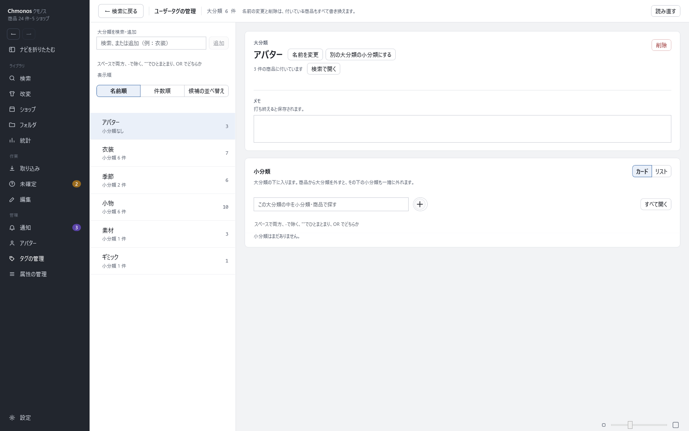
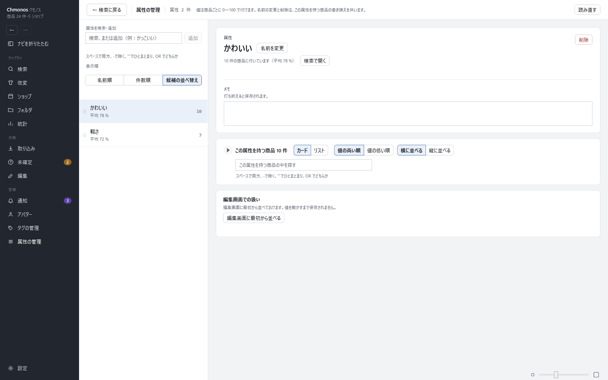

# タグと属性の管理

<!-- nav:top -->
[← 目次へ](README.md)　｜　[← 前の記事：通知の画面](20-inbox.md)
<!-- /nav:top -->

自分で付けたユーザータグと属性の名前を、まとめて整える画面です。左のナビの「タグの管理」「属性の管理」で開きます。
商品に付けるのは編集の画面で行います（[編集の画面](12-edit.md)）。

## タグの管理

名前の変更と削除は、そのタグが付いている商品もすべて書き換えます。

**左：大分類の一覧**

- 上の欄に打つと、一覧が絞られます。同じ名前が無いときは、欄の下の行か Enter で大分類を足せます。同じ名前があれば「既にあります」と出ます
- 「名前順」「件数順」で一覧の並べ方を変えます。「候補の並べ替え」では、検索と編集の画面で候補に出る順を、行をドラッグして決めます

**右：選んだ大分類**

| 部品 | すること |
|---|---|
| 名前を変更 | 大分類の名前を変える |
| 別の大分類の小分類にする | この大分類を、ほかの大分類の下に移す。小分類を持っている大分類ではできません（押せない形で出ます）。元に戻せないので、移す前に件数を出して確かめます |
| 検索で開く | この大分類が付いた商品を、検索の画面で開く |
| この大分類を削除 | 大分類を消し、商品からも外す |
| メモ | 打ち終えると保存されます |
| 小分類 | 丸い「＋」の右の欄に名前を入れて「追加」。小分類を選ぶと、名前の変更・別の大分類へ移す・削除ができます |
| 商品 | この大分類が付いた商品。カードかリストで出ます |

商品に付いているのに一覧に無いタグ（手で JSON を直したときなど）は、「一覧に無いユーザータグ」として出ます。「一覧に追加」するか、既にあるユーザータグへ統合するか、外します。そのままでは絞り込みに出ません。

## 属性の管理

属性の値は、商品ごとに 0〜100 で付けます。名前の変更と削除は、この属性が付いている商品もすべて書き換えます。

| 部品 | すること |
|---|---|
| 左の欄 | 属性を探す・足す（タグの管理の大分類と同じ） |
| 名前を変更・検索で開く・この属性を削除 | タグの管理と同じ |
| この属性を持つ商品 | 値の高い順・低い順、横に並べる・縦に並べる、カード・リストで出す |
| 編集画面での扱い | 「編集画面に最初から並べる」で、編集の画面にこの属性を初めから出しておく。値を動かすまでは保存されません |
| 既にある属性へ統合する | 同じ意味の属性（「かわいい」と「可愛い」など）を1つにまとめる |

<!-- nav:bottom -->

---

[次の記事：設定 →](22-settings.md)
<!-- /nav:bottom -->

<!-- 画像：showcase-tags・showcase-attributes（ViewShot） -->
